# 1. HTLM5 语义标签

## 1.1 基础

### 1.1.1 trae AI编辑器安装

编辑器字体大小： ctrl + + ,  ctrl + - 

代码字体大小： 文件 -> 首选项 -> 设置 -> Editor 设置 -> font size

设置字符缩进： 常用设置 -> tabSize  （为了和 Vue 衔接，tab 缩进2个字符。

保存自动格式化代码：文本格式 -> 格式化 -> format on Save

Liver Server 插件：便于直接打开网页。右击打开


### 1.1.2 Chrome 安装调试

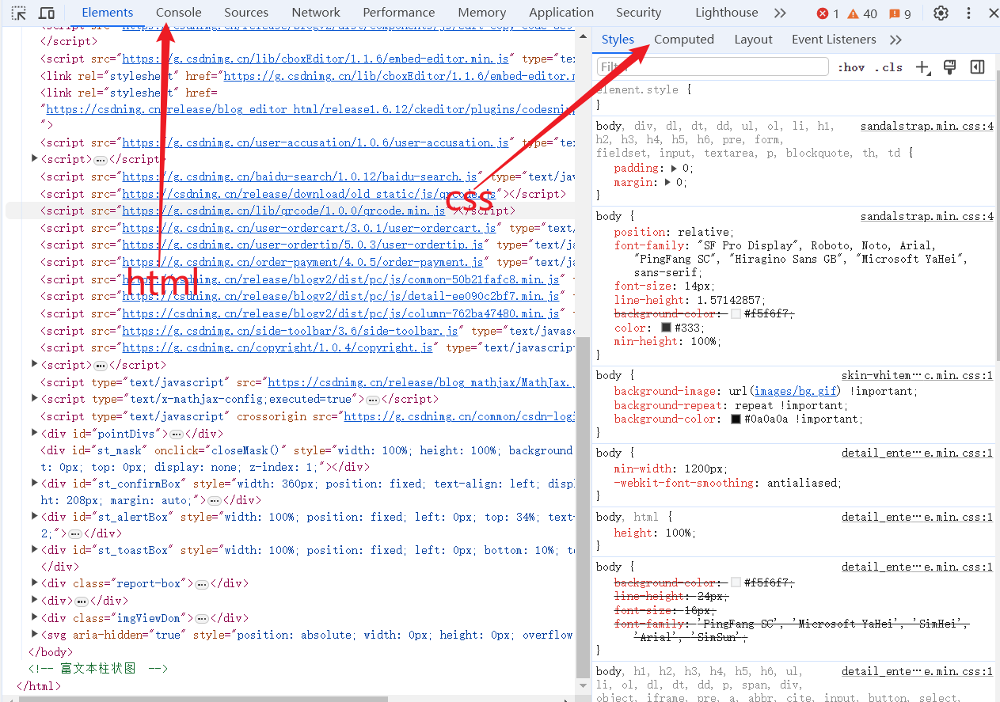


### 1.1.3 HTML 简介

html：超文本标记语言，是一种用来告知浏览器如何组织页面的标记语言。

- 标记也称为标签（元素）。
- 大小写都可以，建议小写。
- html 由一系列的标签组成。

**标签语法：**

- 内容都是写在 body 里面
- 符号： < > 尖括号表示
- 组成： 开始标签，结束标签和内容
- 大部分为双标签，少数单标签（\<hr>  一条线)

**HTML 文档**

文档类型： \<!DOCTTPE html> 。HTML5 的文档类型说明。

html 元素：\<html> 元素。这个元素包裹了页面中所有的内容，有时被称为根元素，在 HTML中，lang 用于声明网页的主要语言，帮助浏览器，搜索引擎等正确处理页面内容。

> en 代表英语
>
> zh -CN 代表中文

\<head>元素：头部元素，包含了文档的元（meta）数据。主要保存供机器处理的信息，而非人类可读信息。

字符集：\<meta charset="UTF-8">。

移动端页面适配：\<meta name="viewport" content="width=device-width, initial-scale=1.0">。开发者确保网页在移动设备上最佳。

title 元素：设置了页面标题，也就是出现在该页面加载的历览器中标签中的内容。

body 元素：包含了页面所有显示在页面上的内容，包含文本、图片、视频、游戏、可播放音频轨道等。


## 1.2 基础标签

### 1.2.1 标签关系

1. 并列关系
2. 嵌套关系

### 1.2.2 HTML的标题和段落

标题标签：`<h1>1级标题</h1>` ....  `<h6></h6>`

- 标题文字会加粗显示，并且每行只显示一个
- 最好只对每个页面使用一次 h1，这是顶级标题
- 争取每页不超过三个。

段落标签p：`<p></p>`
	HTML元素表示文本的一个段落。每行只显示一个，文字显示不开会自动换行，段落相关样式使用 CSS设置。


### 1.2.3 强调与重要性标签

HTML 也提供了相应的标签，使其具有加粗、倾斜、下划线等效果，来着重强调某些文字。

- `<srong></srong>`: 加粗   （`<b></b>`)
- `<em></em>`：倾斜    （`<i></i>`)
- `<ins></ins>`：下划线  (`<u></u>`)
- `<del></del>`：删除线  (`<s></s>`)

**注释标签：**

- `<!-- -->`   ： ctrl + /

  ​	

### 1.2.4 块级元素和内联元素

**块级元素：**

- 块级元素独占一行
- 他可以嵌套其他元素
- 常见的有 p, h, div等

**内联元素：**

- 可以一行放多个，通常与文本一起使用
- 不能嵌套块级元素，可以嵌套其它内联元素。
- 常见的有 strong,  em,  a 等

p 标签不能包含其它块级元素，但是可以包含内联元素。


### 1.2.5 图片标签以及常见格式

html中的图片：`` ， `` 

- 单标签（空元素）：默认包含两个属性，src 和 alt。alt -- 备选文本，用于在图片中无法显示或者因为网速慢情况下显示的文字。
- 其他属性：width,  height, title.   title 是图像标题，鼠标悬停显示的文本。这些属性一般用css 修改。

常见的图片格式：

- jpeg / jpg：有压缩技术，放大缩小会变得模糊或有锯齿。适用场景——摄影图片、网页图片（非透明）
- png：无损压缩，支持透明度。适用场景——Logo、网页图像，需要透明度的图像。
- gif：支持动画，最多256色（索引色），支持简单动画和透明背景。适用场景——简单动画、表情包、低色彩图形。
- webp：Google开发的现代格式。支持有损/无损压缩、透明度和动画。适用场景——网页优化（代替JPEG/PNG/GIF）。
- avif：基于AV1视频编码支持高压缩率和HDR，压缩效率优于Webp. 适用场景——未来网页优化，需高性能压缩的场景。


### 1.2.6 音视频标签及下载方式

**视频标签：**`<video>`元素来嵌入视频。

>`<video src=""></video>`
>
>`<video src="video.mp4" controls="controls" width="300"></video>`

- conrols：显示浏览器自带播放控件（按钮，静音等）。在HTML5中如果属性 键 和 值是相同的，则可以省略值。

- autoplay：自动播放 （要自动播放需要先静音）

- loop：循环播放

- muted：静音

- poster：预览图像（封面）

  > `<video src="video.mp4" width="300" controls muted loop poster="./pig.jpg"></video>`

视频标签兼容性写法：	

```html 
<video controls>
	<source src="video.mp4" type="video/mp4">
	<source src="video.ogg" type="video/ogg">
	<source src="video.webm" type="video/webm">
	<p>您的浏览器不支持 HTML5 video标签。</p>
</video>
```

1. 将 src 属性放在几个单独的`<source>`元素中，这些元素分别只想各自的资源。
2. 浏览器会检查`<source>`元素，并且播放第一个与其自身相匹配的媒体。
3. 每个`<source>`元素都含有 type 属性，浏览器也会通过检查这个属性来迅速跳过那些不支持的格式。如果你没有添加 type 属性，浏览器会尝试加载每一个文件，直到找到一个能正确播放的格式但是这样会消耗大量的时间和资源。

视频标签开发的写法：

```html
<!-- 1 -->
<video src=“video.mp4" poster="">  </video>                 
```

```html
<!-- 2 -->
<video autoplay poster="">
	<source src="video.mp4" type="video/mp4">
     <p>您的浏览器不支持 HTML5 video标签。 </p>
</video>         
```


**视频下载：**  

1. 直接找 scr 地址。
2. bilibili.iiilab.com/


### 1.2.7 创建超链接以及锚点连接

**创建超链接**
	语法： `<a href=" " ></a>`     `<a href="https://www.deepseek.com/">DeepSeek官网</a>`

- href 属性：也称超文本引用或目标，包含一个网址。用来创建一个基本连接。
- 连接可以包含除了自身以外的其它元素，比如文字、标题、图片、视频等。
- titile 属性：鼠标悬停的提示文字
- target 属性：打开页面方式 —— \_self 当前窗口打开（默认）； \_blank 新窗口打开。

1. 内部连接： 网站内部地址
2. 外部连接：网站外部地址

- 空连接：在 HTML 中，空连接通常是指没有实际指向目标的超链接，符号是 #  `<a href="#"></a>`
- 下载连接：如果是 exe 或者压缩包点击是下载   `<a href="download.exe"></a>`
- 邮件链接：某些简单场景或者个人使用情况下使用。   `<a href="mailto:pig@mozilla.org></a>`

**锚点链接：**
	锚点链接允许用户在同一个页面内跳转到指定位置。非常适合长页面导航。

1. 定义锚点目标
   - 用 id 属性创建锚点目标。 `<h2 id="1">第一部分</h2>`
2. 创建跳转链接
   - 使用 # 标记锚点目标。`<a href="#1"></a>`

**页面滑动效果**
	想要点击链接之后，页面具有滑动效果。在 `<head>`标签中添加 css 代码：

``` html 
<style>
    html{
        scroll-behavior:smooth;
    }
</style>
```


## 1.3 布局标签

### 1.3.1 网页结构标签

网页的外观多种多样，但是大概都包含： 页眉、导航栏、主内容、侧边栏、页脚等。

- `<header>` : 网页页眉（头部）
- `<main>`：网页内容。每个网页只能有一个。
- `<nav>`：导航栏
- `<artivle>`：文章相关
- `<section>`：分块。
- `<aside>`：侧边栏
- `<footer>`：页面页脚（底部）

都是双标签。这些标签受到浏览器兼容性问题影响。移动端无所谓。


### 1.3.2 无语义标签

没有合适语义标签时，在进行一些布局的时候可以选择 div 和 span 标签。

**div标签**

- 块级元素：默认独占一行，前后会自动换行。
- 通常用于布局结构，作为其它元素的容器。
- 可以包含其他块级或行内元素。
- 默认没有语义。


**span标签**

- 行内元素：不会换行，仅包裹内容的一部分。
- 用于对文本或行内元素的局部样式或操作。
- 默认没有语义。


### 1.3.3 列表标签

HTML 列表时网页内容组织的重要元素，可以让我们显示内容更加整齐有序。

**无序列表 ul**
顺序无关紧要的列表

```html
<ul>
    <li> </li>
    <li></li>
</ul>
```

- `<ul>` ：定义列表的容器。   只能包含 `<li>`元素。
- `<li>`：定义列表的选项。 里面可以放其它 html 元素。


**有序列表 ol**
顺序有关的列表

```html 
<ol>
    <li> </li>
    <li></li>
</ol>
```


**描述列表 dl**
标记一组项目及相关描述

```HTML
<dl>
    <dt>家电</dt>
        <dd>电视</dd>
        <dd>冰箱</dd>
</dl>
```

- `<dl>`：定义列表的容器。   只能包含 `<dt>` 和 `<de>` 元素。
- `<dt>`：定义被描述的术语。   通常显示为左对齐或加粗。  一个`<dt>` 可以对应多个 `<dd>`。
- `<dd>`：包含术语的定义或描述。


### 1.3.4 表格标签

表格作用：一结构化方式展示行列数据，是信息清晰、易读且便于对比。
网页场景：主要用于数据展示或者后台管理系统的信息展示。

**表格的基本组成：**

- `<table>`：表格容器标签
- `<tr>`：行标签
- `<td>`：单元格标签
- `<th>`：表头标签

美化表格都是用 CSS 。


**表格结构标签**
用于增强语义，让表格结构更加清晰。

- `<thead>`：定义表格的头部区域
- `<tbody>`：定义表格的主体内容。
- `<tfoot>`：定义表格的底部区域。


**合并单元格**
	表格开发中很少使用合并，因为会导致表格难以维护，且可能影响适配（尤其在移动端）。如果需要合并，借助AI。

- 确定跨行(rowspan) 还是跨列(colspan) 合并
- 找到目标单元格（左上原则），写合并数量。(colspan="2")
- 删除多余单元格


### 1.3.5 表单容器

**表单**
	用来收集用户输入的数据，并将数据提交到后端进行处理。场景一般有用户登录/注册、搜索框、联系表单、问卷调查、订单支付、文件上传......

表单组成：

1. **表单容器**： `<form>`,定义表单的容器，包裹所有表单控件。默认包含 action 属性。

   - form标签：`<form action=""></form>`，action 属性定义了在提交表单时，应该把所有收集的数据送给谁（url）去处理。

2. 表单控件：包含 `<input>`通用输入控件、`<textarea>`多行文本输入框、`<select>`下拉选择框、`<button>`自定义按钮等。

   - **input**： `<input type="text">`  它可以创建文本输入框，密码框，单选框，复选框等。

     - 创建文本：

       > text: 单行文本输入框
       >
       > password：密码框
       >
       > radio：单选框
       >
       > checkbox：复选框
       >
       > file：文件域
       >
       > placeholder：提示信息
       >
       > name：元素的名称
       >
       > maxlength：允许的最大字符数
       >
       > accesskey：是元素获得焦点的快捷键
       >
       > autocomplete：用于控制表单的自动填充行为，帮助浏览器决定是否根据用户历史输入自动填充字段取值 on / off

       ```html
       <form action="">
           <ul>
               <li> 
               账号：<input type="text" placeholder="请输入账号" name="username" accesskey="s" autocomplete="off">
               </li>
               <li>
               密码：<input type="password" placeholder="请输入密码" name="pwd" maxlength="6">
               </li>
           </ul>
       </form>
       ```

     - 单选框和复选框
       >radio：单选框
       >
       >checkbox：复选框
       >
       >name：表单名实现分组（实现两个只能选择一个）
       >
       >value：表单值（返回给服务器）
       >
       >checked：是否默认选中
     
       ```html
       <ul>
           <li>
               性别：
               <input type="radio" name="gender" value="0" checked> 女
               <input type="radio" name="gender" value="1" > 男
           </li>
           <li> 
               爱好：
               <input type="checkbox" name="hobby" value="0" > 足球
               <input type="checkbox" name="hobby" value="2" > 篮球
               <input type="checkbox" name="hobby" value="2" > 双色球
           </li>
       </ul>
       ```
     
     - 文件域 file
       >multiple：允许选择多个文件
       >
       >accept：规定选择的文件类型，多个类型中间用逗号分隔
     
       ```html 
       <ul>
           <li>
           	头像：
               <input type="file" name="file" multiple accept=".exe, .jpg, .png, .mp4">
           </li>
       </ul>
       ```
     
   -  **textarea**
     `<textarea> </textarea>` 是一个多行纯文本编辑控件，适用于允许用户输入大量自由格式文本的场景，例如评论或反馈表单。

     >name：表单名称
     >
     >placehoder：提示信息
     >
     >rows：文本行数，正整数，默认为2
     >
     >cols：文本列数，正整数，默认为20

     ```html
     <ul>
         <li>
             留言：
         	<textarea name="msg" cols="30" rows="30" placehlder="请输入留言">
             </textarea>
         </li>
     </ul>
     ```

   - **select**
     表示一个提供选择菜单的控件。`<select></select>`是容器，`<option>`时每一个选项标签，每个选项要跟一个值。要想默认选中一个选项，可以添加 selected属性。

     ```html
     <select>
         <option value="北京" selected>北京</option>
         <option value="深圳">深圳</option>
     </select>
     ```

   - **button**
     `<button>搜索</button>` : 定义一个按钮，元素内部可以放置内容，比如文本或图像。

     >disabled：禁用按钮，无法点击。

   

3. **辅助标签**：`<label>`关联输入控件的文本标签，提升可访问性（点击标签可聚焦输入框）。

   方式一：利用 for 和 id 相关联

   ```html
   <label for="nan"></label>
   <input type="radio" id="nan" name="sex">
   ```

   方式二：直接包含

   ```html
   <label> 男
   	<input type="radio" name="sex">
   </label>
   ```

   

## 1.4 字符实体

字符实体时一段以连字号（&）开头、以分号（；）结尾的文本（字符串）。常用于显示保留字符和不可见字符（如“不换行空格”）。

| 字符 | 实体     | 说明                               |
| ---- | -------- | ---------------------------------- |
| &    | \&amp;   | 实体或字符引用的开头               |
| <    | \&lt;    | tag的开头                          |
| \>   | \&gt;    | tag 的结尾                         |
| "    | \&quot;  | attribute 的值的开头和结尾         |
|      | \&nbsp;  | 不换行空格                         |
| -    | \&ndash; | 短破折号（等于 em 单位的一半宽度） |
| —    | \&mdash; | 长破折号（等于 m 字符的宽度）      |
| ©    | \&copy;  | 版权符号                           |
| ®    | \&reg;   | 注册商标符号                       |
| ™    | \&trade; | 商标符号                           |
| ≈    | \&asymp; | 约等于                             |
| ≠    | \&ne;    | 不等于                             |
| ￡   | \&pound; | 英镑                               |
| €    | \&euro;  | 欧元                               |
| °    | \&deg;   | 度                                 |


# 2. CSS3 核心技术

## 2.1 CSS3 基础知识

### 2.1.1 CSS 简介

CSS(Casscading Style Sheets)。是用来控制网页在浏览器中的显示外观语言。 

- 样式美化：文本样式、背景、边框等
- 布局与定位：元素排列、响应式设计
- 动画交换：伪类、过渡、动画


### 2.1.2 CSS 分类

**位置分类：*

- 内联样式表（行内样式表）：样式写到标签内部，可以控制当前标签的样式，特殊情况使用。`<p style="color:red; font-size:14px;"></p>`
- 内部样式表：写到`<head>`标签中，脱离结构，可以控制当前页面的所有标签，较为常用。
- 外部样式表：单独新建一个CSS文件，完全脱离结构，可以控制整个网站的所有标签。`<link rel="stylesheet" href="./css/index.css">           `（放在`<head>`中）


## 2.2 CSS3 选择器

CSS 选择器时 CSS 规则的第一部分。它是选择 HTML 元素的方式。

- CSS选择器：选择标签。

- CSS 属性：采取键值对形式。 属性名：属性值 ;


**选择器分类**： 根据使用场景不同，选择器也分不同类型。

### 2.2.1 基础选择器

由单个选择器组成

- 类型选择器：`p { color: gold}`。选择某个类型元素，也称标签选择器。

- 类选择器：`.box{ color: gold}`. 可以选择一个或则多个元素。CSS: `.类名{样式声明;...}`。html：`<标签 class="类名">`。class 属性可以有多个类名中间用空格隔开。

- id 选择器：`#box { color: gold}`。具有特定 id属性的唯一元素。CSS：`#id{样式声明;...}`。html：`<标签 id="id名">`

  >后期修改样式基本都是类选择器。
  >
  >id选择器主要是配合 JavaScript 添加交互效果。

- 通配符选择器：`* {color: gold}`。可以选择所有标签，进行样式修改。

  ```css
  * {
      margin: 0;  /* 去除所有元素的外边距 */
      padding: 0;  /* 去除所有元素的内边距 */
      box-sizing: border-box;  /* 统一盒模型 */
  }
  ```

### 2.2.2 关系选择器

通过关系来选择目标元素（标签），可以精准选择某些元素，常见的有：

- 后代选择器：选择某个元素的后代元素（不限层级，包括子元素、孙元素等）。`.box p { color: pink}`。
- 子代选择器：选择某个元素的直接子元素（仅限一层）。`.box>p {color: pink}`。
- 邻接兄弟选择器：选中紧跟在 h2 后面的第一个 p 元素。`h2+p { color: pink}`。
- 通用兄弟选择器：选中紧跟在 h2 后面的所有 p 元素。 `h2~p { color: pink}`。


### 2.2.3 分组选择器

是将不同的选择器组合在一起，使用逗号分割。也成为并集选择器。

- 适用场景： 

  1. 多个元素具备相同样式。

- 语法：

  `div, span {color: pink}`


### 2.2.4 伪类和伪元素

**伪类选择器：**

选择元素的特定状态或结构位置，符号是冒号（:）

- 状态伪类：根据用户交互或状态变化选择。比如鼠标经过链接、表单获得焦点等。

  - 链接伪类：用于根据链接的不同状态（如为访问、悬停、点击等）为其添加样式。

    - 使用场景：设置链接不状态的样式。
    
    - 语法：
    
      `a:link`：为访问链接的默认样式。 `a:link {color: #666; text-decoration:none}`
    
      `a:visited`：已访问链接的样式
    
      `a:hover`：鼠标悬停在链接上时的反馈
    
      `a:achive`：链接被点击时的瞬时状态（按下到松开）
    
    > 调试工具查看伪类状态：前世显示状态
    
  - 用户行为伪类：用于以某种方式和文档交互的时候应用，这些用户行为伪类，有时叫做动态伪类。

    - 适用场景：鼠标经过元素的时候，修改样式。  表单获得焦点的时候。

    - 语法

      `:hover`：鼠标经过元素

      `:focus`：获得焦点的元素（表单）。`div:hover {background: red}`

- 结构伪类：根据元素的位置选择目标元素。比如选择第5个第10个元素、选择前3个元素等。

  - 语法：

    `:first-child`：一组兄弟元素中的第一个元素。`.ul li:first-child {color: blue}`

    `:last-child`：一组兄弟元素中的最后一个元素。

    `:nth-child(n)`：一组兄弟元素列表中第n个元素。

    >n的取值可以是：
    >
    >1. 数字。从1开始。
    >
    >2. 关键字。odd 奇数， even 偶数。
    >
    >3. 公式：
    >
    >   :nth-child(3n) 3的倍数，
    >
    >   :nth-child(n+3) 第2个以后
    >
    >   :nth-child(-n+3)  前3个
    >
    > 公式开始n从 0 开始计算。

    >表格单元格合并相邻边框：
    >
    >border-collapse: collapse;

- 表单伪类：针对表单元素的状态。比如表单禁用、选中复选框等。

  - 使用场景：

    1. 表单按钮禁用的时候，调整颜色。
    2. 复选框选中修改样式。

  - 语法：

    `:disabled`：表单禁用

    `:checked`：选中状态，单选复选按钮

    >opacity: .4;         /*  透明度,让整个按钮透明 0~1   */
    >
    >input:checked+label { color: red}   /* 表单被选中伪类选择器,选中后label才会变颜色*/


**伪元素选择器：**

选择元素的特定部分（使用双冒号 :: ）

- 使用场景：

  1. 让表单里面的 placholder 文字变颜色
  2. 做很多的修饰效果

- 选择特定部分：

  `::first-line`：选择首行

  `::first-letter`：首字母

  `::placeholder`：选择 inpust 或者 textarea 占位符。`textarea::placehoder {color: red}`

- 插入内容：

  `::before`：元素内插入伪元素，作为第一个元素

  `::after`：元素内插入伪元素，作为最后一个元素

  ```html
  div::before{ 
  	content: "开始";
  	color:red;
  }
  
  div::after {
  	content: "结束";
  	color: red;
  }
  ```

  > before 和 after 是插入的伪元素，特性类似于内联元素。
  >
  > content 属性是必须的，不能省略，没有内容空引号即可。
  >
  > 后期非常常用。比如小图标，各种装饰效果。

​		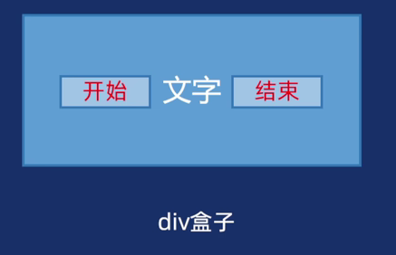


### 2.2.5 属性选择器

根据元素的属性特征来精准定位元素，从而实现更灵活的样式控制。

- 适用场景：

  1. 表单样式控制
  2. 图标字体控制
  3. 国际化语言适配等等

- 语法：
  [属性]：匹配包含指定属性的元素

  [属性=值]：匹配属性值等于指定值元素

  [属性^=值]：匹配属性值以指定字符串开头的元素

  [属性$=值]：匹配属性值以指定字符串结尾的元素（不能只有数字）

  [属性*=值]：匹配属性值任意位置包含指定字串的元素


> CSS 层叠性:
>
> CSS 规则可以同时作用于一个元素,浏览器通过特定规则决定最终生效的样式. 层叠行解决了样式冲突问题.
> 原则: 后定义的样式覆盖先前的样式.(就近原则)


## 2.4 文本样式

CSS 文本样式用于控制网页中中文字的外观，包括字体、颜色、对齐、间距等。主要分为两大类：

- 字体样式

- 文本布局

  > 文字是无法直接通过CSS 来更改样式的，必须使用合适的标签包裹他们，本质是修改标签样式，里面的文字跟随样式变化。

### 2.4.1 字体样式

给文字设置颜色、大小、粗体、装饰等效果。

- color : 设置字体颜色。
  - 关键字：`p {color: pink;}`
  - 十六进制：`p {color: #f00}`
  - rgb格式：`p {color: rgb(255,0,0)}`;   rgba(255, 0, 0, 0.3) 文字透明。
  
- font-family： 字体族。给定一个有先后顺序的，由字体或字体族名组成的列表来为选定的元素设置字体。

  - `body {font-family: Arial, Helvetica, sans-serif; }`。会选择列表中第一个该计算机上有安装的字体。

- font-size：字体大小。

  - `p {font-size: 16px;}`

    > 像素 px：CSS像素是 css 中用于定义长度、尺寸的单位。

- font-style：字体风格。用来打开和关闭文本 italic （斜体）。

  - `p {font-style: italic; }`。属性：normal,   italic

- font-weight：字体粗体。

  - 属性值：normal（正常粗细）。bold（加粗）。
  - 数字属性值：400（正常粗细）。700（加粗）。取值范围100~900之间，常用就是400和700。

- text-decoration：字体装饰。设置/取消字体上的文本修饰。

  - 适用场景：
    1. 最常见设置连接下划线，比如取消下划线。
    2. 特殊情况下添加删除线。
  - 属性值：
    - none：取消文本装饰。
    - underline：下划线。
    - overline：上划线。
    - line-through：穿过文本的线。


### 2.4.2 文本布局

作用于文本的对齐、缩进、间距等布局功能的属性。

- text-align：文本对齐。控制文本在它所在的块级盒子内如何水平对齐。

  - 适用场景：

    1. 文本/图片在盒子对平对齐。
    2. 文章文字两端对齐。 

  - 属性值：

    - left：文本左对齐（默认）
    - right：文本右对齐。
    - center：文本水平居中对齐。
    - justify：自动改变字间距，两端对齐。

    

- text-indent：首行缩进。设置块级元素中文本行前面的空格（缩进）的长度。

  - 适用场景：
    1. 段落首行缩进2个字的效果。
    2. logo隐藏文字效果。
  - 属性值：
    - 数字：常见单位是em，相对单位，本元素的文字大小 1 em 等于当前元素的字体大小，如果当前元素没有大小，则按照父元素文字大小。


- letter-spacing：文本字符间距。调整字与字之间距离。
  - `p {letter-spacing: 2px}`。


- line-height：行高。
  - 使用场景：
    1. 设置多行文本之间的上下间距。
    2. 让单行文本垂直居中。
  - 属性值：
    - 数字 px
    - 数字不带单位（当前字体大小的倍数）：`p {line-height: 1.5}`。


### 2.2.3 font简写

font 简写属性在一个声明中设置多个字体属性。给整个页面设置相关字体样式。

语法：`font: font-style font-weight font-size/line-height font-family`.

> font-size 和 font-family 是必须写
>
> 其它可以省略，默认显示


## 2.5 CSS 三大特性

### 2.5.1 继承性

子元素自动继承父元素的某些CSS样式属性。

- 主要继承跟文字相关的样式属性，比如字体、颜色、文本对齐等。
- 但是子元素定义自己样式，会优先自己样式。
- 通过调试中的 inherited from 查看


### 2.5.2 层叠性

后面样式会覆盖前面样式，主要解决样式冲突问题。但是要开选择器权重来确定优先级。

### 2.5.3 优先级

浏览器通过优先级来判断哪些属性值与一个元素最为相关。优先级是基于不同种类选择器组成的匹配规则。

- 原则：

  1. 优先级相等的时候，CSS 中最后的那个声明的样式将会被应用到元素上。（层叠遵循就近原则）

  2. 其余判断那个选择器权重高，优先执行那个样式。

  3. 权重是4位一组，是分开的层级，不能进位。

     | 选择器类型          | 示例                      | 权重值       | 优先级说明                      |
     | ------------------- | ------------------------- | ------------ | ------------------------------- |
     | !important          | color: red !important;    | 无限大       | 强制覆盖所有规则（慎用）        |
     | 内联样式            | \<div style="color: red"> | (1, 0, 0, 0) | 行内样式权重最高（1, 0, 0, 0)   |
     | ID选择器            | #myld                     | (0, 1, 0, 0) | 每个ID 增加 0, 1, 0, 0          |
     | 类/属性/伪类        | .class, [type="text"]     | (0, 0, 1, 0) | 每个类/属性/伪类增加 0, 0, 1, 0 |
     | 类型（标签）/伪元素 | div, ::after              | (0, 0, 0, 1) | 每个标签/伪元素增加 0, 0, 0, 1  |
     | 通配符/继承         | *, 继承样式               | (0, 0, 0, 0) | 通配符和继承权重最低            |

- 权重叠加：

  权重是累加的，每个选择器的层级权重相加。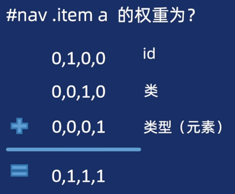


## 2.6 盒子模型

所有的元素都被一个个的 “盒子” 包围着，学会盒子模型可以实现准确布局，处理元素排列的关键。在 CSS 中，我们有几种类型的盒子，一般分为区块盒子和行内盒子。

**区块盒子（block）**

- 盒子会产生换行。
- width 和 height 属性可以发挥作用。
- 不设置宽度则默认和是父元素空间 100%。
- 内边距、外边距和边框会撑大元素。
- 常见的比如： div、p、h、ul、talbe等。

**行内盒子（inline）**

- 盒子不会产生换行。
- width 和 height 属性将不起作用。
- 垂直方向的内边距、外边距不起效果。
- 水平方向的内边距、外边距会有效果。
- 常见的比如：span、em、a、strong等。


### 2.6.1 盒子模型的组成部分

CSS 盒子模型整体上适用于区块盒子，包含 盒子内容、内边距、外边距、边框 四部分

- 盒子内容：显示内容的区域，有内容或者指定宽度高度来决定内容大小。
- 内边距 padding：内容距离边框之间的距离。
- 边框 border：边框盒子包住内容和内边框。
- 外边距 margin：该盒子与其他元素之间的距离。


**边框 border**

border 属性用于设置盒子边框

**盒子四条：**

- 属性值：

  `border`：边框粗细、边框样式、边框颜色。

  边框由三部分属性组成，中间必须空格隔开。

  三部分属性值没有先后顺序。

  `border: 1px solid #f1f1f1`

- 边框样式：

  `dotted`：点状边框，圆点组成的虚线。

  `dashed`：虚线边框，短横线组成的虚线。

  `solid`：实线边框，单一线条。

  `double`：两条

**单独一条：**

- 属性值：

  `border-top: 1px solid pink`

  `border-bottom: 1px solid pink`

  `border-left: 1px solid pink`

  `border-right: 1px solid pink`

**圆角边框：**

border-radius 允许你设置元素的外边框圆角。

- `border-radius`：属性值；

​		数字/ 百分比：`.botton {border-radius: 10px}`

- 特殊情况

  `border-radius: 10px;`

  `border-radius: 10px 20px;`：左上 右下 10px， 右上 左下 20px。 对角线。

  `border-radius: 10px 20px 30px`： 左上 10px, 右上 左下 20px， 右下 30px。（写完左上，再对角线）

  `border-radius: 10px 20px 30px 40px; `：左上 10px, 右上 20px，右下 30px，左下40px。（从左上顺时针）

​	

**内边距 padding**

内边距（padding）位于边框和内容区域之间。多个值用空格隔开，顺时针记忆。

- 写法：

  `padding: 10px`： 上下左右4个内边距都是10px。

  `padding: 10px 20px`：上下内边距都是10px， 左右内边距是20px。

  `padding: 10px 20px 30px`：上是10px, 左右是 20px, 下是30px。

  `padding: 10px 20px 30px 40px`：上是10px， 右是 20px， 下是30px， 左是40px。（顺时针）

- 单边距设置：根据方位名词。

  `padding-left: 10px`

  `padding-right: 10px`

  `padding-top: 10px`

  `padding-bottom: 10px`


 **外边距 margin**

外边距（margin）是盒子周围一圈看不到的空间。他会把其他元素推离盒子。多个值用空格隔开。

- **外边距写法：**
  `margin: 10px`： 上下左右4个外边距都是10px

  `margin: 10px 20px`：上下外边距是 10px，左右外边距是 20px

  `margin: 10px 20px 30px`：上10px, 左右20px，下30px。

  `margin:10px 20px 30px 40px`：上10px, 右 20px, 下30px, 左40px。（顺时针）

- **单边距设置**：根据方位名词

  `margin-left: 10px`

  `margin-right: 10px`

  `margin-top: 10px`

  `margin-bottom: 10px`

>1. 行内元素左右外边距生效，上下外边距无效。
>2. 行内元素设置宽度和高度也无效。
>3. computed 查看盒子。


- 区块元素可以利用 margin **实现水平居中**：`margin: auto`;    `margin-left: auto; margin-right: auto;`

  - 块级盒子必须有宽度

  - 只需要设置左右外边距伪 auto 就可以；

- **外边距的折叠**：

  区块元素上下外边距会出现折叠（合并）情况。

  - 合并关系（兄弟）的区块元素。
  - 两个上下外边距将合并为一个外边距，其大小等于最大的单个外边距。

- **外边距塌陷：**
  区块元素上下外边距会出现塌陷情况。 

  - 嵌套关系（父子）的区块元素。
  - 给子盒子设置上下外边距会让父盒子塌陷移动。

  >**解决方案：**
  >
  >1. 给父盒子添加上边框。（父盒子本身右边框则不会出现问题）margin
  >2. 给父盒子添加上内边框。（同理）padding-top;
  >3. 给父盒子添加： `overflow: hidden;` 属性


 **尺寸计算**

在 CSS 盒子模型的默认定义里，除了宽度和高度增加盒子大小之外，padding 和 border 都会让盒子变大。


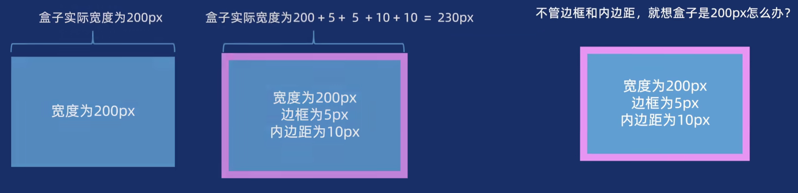


`box-sizing` 用于定义元素的 盒模型计算方式，控制元素的 width 和 height 是否包含 padding 和 border。

- 语法：
  `box-sizing`：属性值； `box-sizing: border-box;`

- 属性值： 

  `content-box`：默认值。元素的 width 和 height 仅包含内容区域，不包括 padding 和 border。 width = 内容的宽度。

  `border-box`：元素的 width 和 height 包含内容，padding 和 border。 width = border + padding + 内容的宽度。

实际开发中，更加提倡使用 border-box，可以直接让所有标签修改。


### 2.6.2 盒子背景

background 用于设置元素背景相关属性，包括背景颜色、背景图片、背景位置、背景重复方式等。


| 属性                    | 作用                 | 常用值                                              |
| ----------------------- | -------------------- | --------------------------------------------------- |
| `background-color`      | 设置元素背景颜色     | 颜色名称、十六进制、RGB、透明度                     |
| `background-image`      | 设置背景图片         | url(imag.jpg)                                       |
| `background-repeat`     | 控制背景图片是否重复 | repeat(默认), no-repeat, repeat-x, repeat-y         |
| `background-position`   | 定位背景图片位置     | x y（如 cente top, 或者 px, %单位， 方位名词）      |
| `background-size`       | 调整背景图片尺寸     | 默认 auto, cover(覆盖), contain(包含), 或者跟 px, % |
| `background-attachment` | 背景是否随页面滚动   | scroll(默认), fixed（相当于当前视口）               |

**背景复合型写法**
`background: 颜色 图片 重复 固定 位置/尺寸;` （与顺序无关）


**背景渐变：**

在CSS中，可以通过 linear-gradient（线性渐变）和 radial-gradient（径向渐变）为元素添加渐变背景。

| 属性/方法                                           | 描述                       | 示例代码                                           |
| --------------------------------------------------- | -------------------------- | -------------------------------------------------- |
| `linear-gradient(方向，颜色1 位置，颜色2 位置... )` | 线性渐变（方向可控）       | `bakcground: linear-gradient(to right, pink, red)` |
| `radial-gradient(形状，颜色1， 颜色2) `             | 径向渐变（形状和卫视可控） | `radial-gradient(circle, pink, red)`               |

>线性渐变:
>
>1. 方向. 可以是方位名词,也可以是 deg(角度)
>2. 位置. 色标的位置,不是必须写的.
>
>文本渐变:
>
>​	`-webkit-background-clip: text;`  (兼容性写法)
>​	`bakcground-clip: text;`  
>​	`-webkit-text-fill-color: transparent;`  文本填充颜色为透明度(蒙版)


### 2.6.3 盒子阴影

CSS box-shadow 属性用于在元素的框架上添加阴影效果。

- 语法：box-shadow: X 轴偏移量 Y 轴偏移量 模糊半径 扩散半径 颜色；

  - 多个属性用空格隔开
  - X轴 偏移量 和 Y 轴偏移量必须写，其余可以省略采取默认值。
  - 默认是外阴影，如果改为内阴影要写 inset

  `.nav li {box-shadow: 0 15px 30px 20px rgba(0,0,0,.1)}`


### 2.6.4 过渡

过渡效果（Transition）用于在元素的属性值发生变化时，平滑的过渡（而不是瞬间切换）。例如鼠标经过图片放大，表单获得焦点输入框变宽。

- 语法： `transition: 过渡属性 过渡时间`

  - 属性值中间空格隔开

  - 过渡属性如果都要变换可以写 all 

  - 过渡时间单位是秒 s.

    `input:hover {transition: all 0.3s}`


### 2.6.5 样式初始化

浏览器对 HTML 元素有默认样式（如 margin, padding, font-size），不同浏览器的默认样式可能不一致，导致跨浏览器兼容性问题。

**初始化的核心目的：**

- 统一浏览器默认样式，消除差异。

- 减少后续开发中的冗余代码。
- 提高代码可维护性。

**小型项目**：

```css
* {
	margin: 0;
	padding: 0;
    box-sizing: border-box;
}

/* 重置列表样式 */
ul, 
ol {
    list-style: none; 
}

/* 重置链接样式 */
a {
    text-decoration: none;
}
```


**中大型项目：推荐 Normalize.css**
	引入 Normalize.css 文件。

​		`<link rel="stylesheet" href="./css/Normalize.css">`

​	官网下载地址：https://necolas.github.io/normalize.css/


## 2.7 字体图标

字体图标（Icon Fonts）是一种将图标以文字形式嵌入网页的技术，允许开发者像使用文字一样通过 CSS 控制图标的样式（如颜色，大小，阴影）。

| 图标库          | 特点                                               | 官网链接                |
| --------------- | -------------------------------------------------- | ----------------------- |
| Font Awesome    | 图标最全，支持免费版和 pro 付费版                  | fontawesome.com         |
| Bootstrap Icons | Bootstrap 生态内图标，简单易用                     | icons.getbootstrap.com  |
| icomoon         | IcoMoon 最早推出了第一个自定义图标文字生成器       | icomoon.io              |
| iconfont        | 阿里字体库，包含淘宝图标库和阿里爸爸图标库（免费） | http://www.iconfont.cn/ |

1. 下载字体图标文件

   去官网或者设计师准备字体图标文件，保存到项目目录下。（下载代码）

2. 引入 html 文件中

   根据提供的压缩包，引入 CSS文件（link方式）。`<link rel="stylesheet" href="./iconfont/iconfont.css">`

3. 使用字体图标

   一般情况下，我们通过标签调用类名选择对应字体图标。根据时间需求，调整字体样式，比如颜色、大小、位置等。

   （可以在 iconfont 文件夹中 demo.html 打开查看）

## 2.8 精灵图

CSS 精灵图（CSS Sprites）是将多个小图标或图像合并到一张大图中，通过调整 background-position 属性来显示特定部分的图像技术。

通过合理使用 CSS 精灵图，可以有效优化网页性能。对于复杂场景（如高清屏适配），建议结合 SVG 或字体图标使用。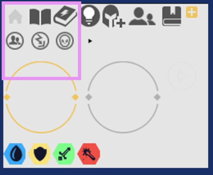)


**原理**

1. 给盒子添加背景图片。
2. 通过背景定位（background-position）移动位置对齐。
3. 注意网页坐标不同。

测量工具：https://tugaigai.com/onlie_ps/


# 3. 现代网页布局

CSS 布局是网页设计的核心技术之一，用于控制元素在页面中的排列方式。

每种技术都有用途，各有优缺点，相互辅助。

- 简单布局：优先使用 Flexbox（一维）或 Grid （二维）。
- 复杂响应式布局：使用 Grid + 媒体查询。
- 文本内容分栏：多列布局（column-count）
- 兼容旧浏览器：浮动布局 或 Flexbox 的降级方案。
- CSS Grid 逐渐成为主流，支持更复杂的布局场景。


## 3.1 模式转换


1. **CSS正常布局流**
   正常布局流（normal flow）是指在部队页面进行任何布局控制时，浏览器默认的 HTML 布局方式，也称 标准流。正常布局流时 CSS布局的基石，页面大的布局基本就是利用区块元素上下罗列而成的。
   - 区块元素（block)
   - 行内元素（inline）
   - 文档流方向：默认从上到下，从左到右排列。

>**display 显示属性**
>
>正常流中的所有内容都有一个 display 的属性,用作元素的默认行为方式.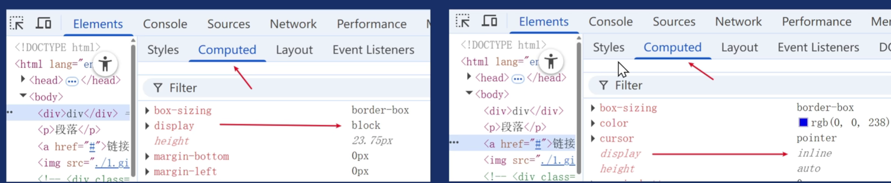


2. **display 转换**

   display 属性允许我们更改默认的显示方式此属性.

   `display: block;`: 转换为区块元素.

   `display: inline`: 转换为行内元素.

   `display: inline-block`: 转换为行内块元素.

   表单元素默认为 inline-block, 其它元素都想要转换可以: `display: inline-block;`

   > 1. 行内块元素中间会有空白缝隙.给父元素字号改为 0 可以去掉. `font-size: 0`
   > 2. 实际开发适合于对兼具要求不高的情况下可以转换.
   > 3. 如果真的要精细布局,请使用 flex 或者 grid 更合适.


3. **浮动**

   浮动（float）最早是做“文字环绕”效果的。

   浮动可以让元素脱离文档流，向左或向右浮动，直到碰到父容器边缘或其他浮动元素。

   ​	`left`: 左侧浮动， `float: left;`

   ​	`right`：右侧浮动，`float: right`

   ​	`none`：默认值，不浮动。 `float: none`

   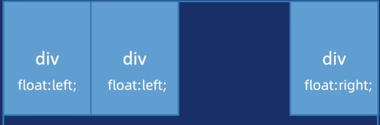


> 脱离文档流： 盒子上浮其它文档流（标准流）上，浮动的盒子不占位置。


**浮动带来的影响：**

1. 父盒子没有高度。（很多情况下不能给父亲指定高度）
2. 子元素浮动。
3. 影响其他盒子布局了.


**清除浮动:**

​	清除浮动也可以理解为闭合浮动,简单来说,就是让浮动的元素尽量控制在父盒子内,不要影响其它盒子.清除浮动元素主要有四种方式:

1. 额外标签法: 在浮动元素的最后面,新增一个块级标签. 添加属性: `clear: both;`
2. 单伪元素清除浮动: 父元素添加伪元素. `clearfix: after{visibility: hidden; clear: both; display: block; content: "."}`
3. 双伪元素清除浮动: 父元素添加双伪元素.  `clearfix: after, .clearfix: before {content: "", display: table}`, '`.clearfix:after {clear: both}`
4. voerflow 清除浮动: 父元素添加 overflow.


## 3.2 flex 布局（弹性盒子）

Flexbox 是 CSS 弹性盒子布局模块（ Flexible Box Layout Module）的缩写，可以快速实现元素的对齐、分布和空间分配。

**弹性盒子的核心：**

1. 父控子（亲父子）
   - 父盒子控制子盒子如何排列布局
   - 父盒子称为容器，子盒子称为项目。
2. 主轴和交叉轴（侧轴）
   - 主轴默认水平方向，交叉轴默认垂直方向，可以更改。

容器属性：

| 属性              | 作用                                                         | 示例                               |
| ----------------- | ------------------------------------------------------------ | ---------------------------------- |
| `display`         | 定义元素为 flex 容器                                         | `.container{display: flex;}`       |
| `flex-direction`  | 定义主轴方向（项目排列方向）                                 | `.container{flex-direction: row;}` |
| `flex-wrap`       | 控制是否换行                                                 | `flex-wrap: wrap`                  |
| `justify-content` | 定义主轴上的对齐方式（整体分布）                             | `justify-content: center;`         |
| `align-items`     | 定义交叉轴上的的对齐方式（单行时整体对齐）                   | `align-items: center`              |
| `align-content`   | 定义多行时交叉轴上的对齐方式（仅当 flex-warp: wrap 且内容换行时生效） | `align-content: space-between`     |


容器（父盒子）设置 `display: flex;` 可以让子盒子按照主轴方式排列。

- 如果子元素有大小，按照给定大小来显示。
- 如果子元素没有大小，则拉伸充满父容器。
- 若子元素总宽度超过容器宽度，默认会压缩子元素。


`justify-content`定义主轴上的对齐方式：

- `flex-start`：左对齐（默认）， 子元素紧靠左排列
- `flex-end`：右对齐，子元素紧靠右排列
- `center`：居中对齐，子元素居中
- `space-between`：两端对齐，首个子元素放置于起点，末尾元素放置于终点。
- `space-around`：项目两侧间隔相等，每个子元素周未分配相同的空间。
- `space-evenly`：项目间隔均匀分布，每个子元素之间的间隔相等。

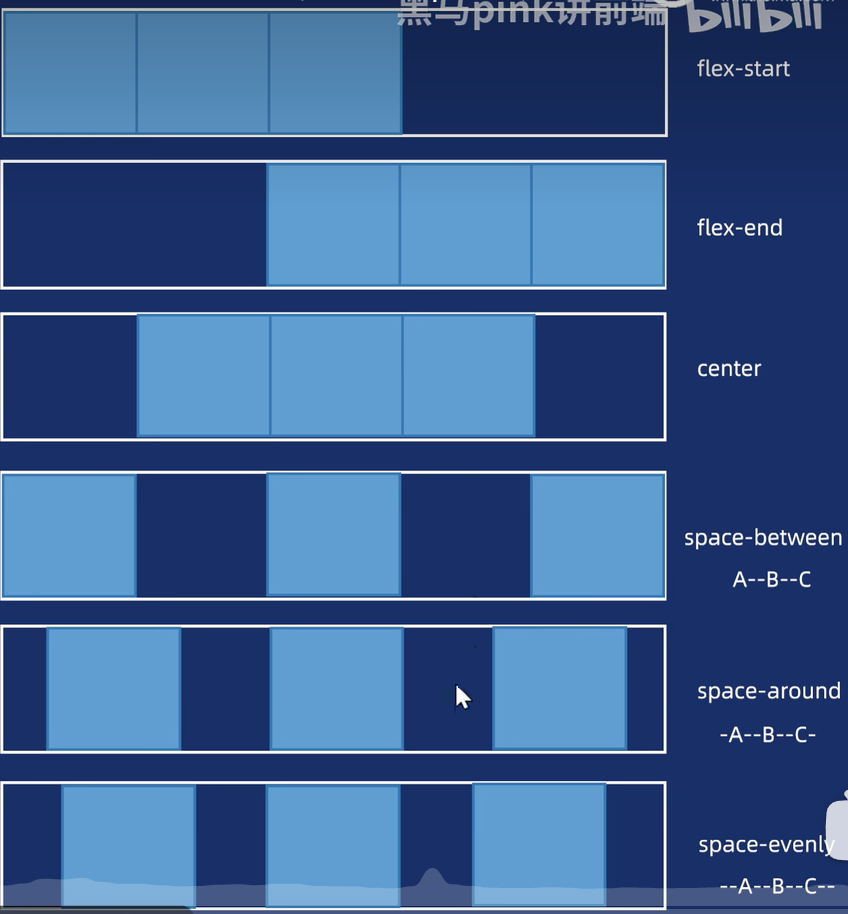


`align-items`定义交叉轴上的对齐方式（单行时整体对齐）

- `flex-start`：项目在交叉轴起点对齐（默认值）
- `flex-end`：项目在交叉轴中终点对齐
- `center`：项目在交叉轴居中对齐。
- `stretch`：项目拉伸填充整个容器高度（需子项目无固定高度） 

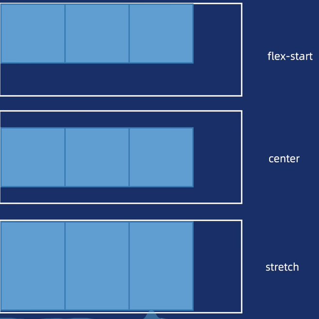


`flex-direction`定义主轴方向（改变主轴方向）

- `row`：默认值。子元素沿水平主轴（从左到右）排列。
- `row-reverse`：子元素沿水平主轴反向排列（从右到左）。
- `column`：子元素沿垂直主轴（从上到下）排列。
- `column-reverse`：子元素沿垂直主轴反向排列（从下到上）。 


`flex-wrap`控制是否换行

- `nowrap`：不换行（全部横向排列，可能被压缩）
- `wrap`：换行
- `wrap-reverse`：翻转

​	

`align-content`定义多行时交叉轴上的对齐方式（仅当 flex-wrap: wrap 且内容换行时生效）

- `flex-start`：上对齐，子元素靠上排列
- `flex-end`：下对齐，子元素靠下排列
- `center`：居中对齐，子元素居中
- `space-between`：两端对齐，首个子元素放置于起点，末尾元素放置于终点
- `space-around`：项目两端间隔相等，每个子元素周围分配相同的空间。
- `space-evenly`：项目间隔均匀分布，每个子元素之间的间隔相等


**弹性盒子**

项目（子盒子）属性。

子元素的属性用于控制自身的尺寸、顺序或对齐方式。

- **语法：**

  - `flex: 1` 剩余空间占1份，并且可以伸缩盒子大小。
  - 数字表示剩余空间所占份数，正整数。

  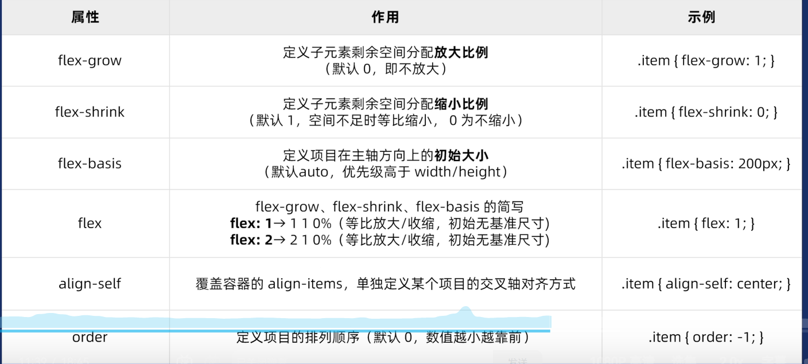


**gap 间距**
gap 简写属性用于设置行与列之间的间隙（间距） 

- 语法： 

  `gap: 20px; ` 行和列之间保持 20像素间隙

  `gap: 20px 30px` 行间距是20像素，列间距是30像素。

  >gap是写到父元素（容器身上）


**多行伸缩：**

淘宝做法： `flex: 0, 0, 16.66%` （每行放6个）

京东做法：`min-width: calc(16.66% - 16px); max-width: calc(16.66% - 16px)`


## 3.3 定位布局

CSS 定位布局（position）是控制元素在页面中位置的核心技术之一。通过定位，可以实现元素脱离文档流，层叠、固定在特定位置布局效果（定位跟位置有关）

定位分类：

- 相对定位
- 绝对定位
- 固定定位
- 粘性定位


### 3.3.1 相对定位

CSS相对定位（position：relative）是布局中常用的定位方式，其核心在于元素相对于自身正常位置进行偏移。和绝对定位搭配使用。

- **语法**： `position: relative`  设定元素为相对定位
  - 相对于自身原来位置移动距离。
  - 不脱离正常流，元素原位置仍被保留，其他元素按原布局排列。
  - 可以通过 top, bottom, left, right 属性进行偏移。
  - 优先级：若同时设置 top 和 bottom， 仅 top 生效；同理 left 覆盖 right.


### 3.3.2 绝对定位

 CSS 绝对定位（position: absolute ）核心是 脱离正常流并基于定位基准进行偏移。

- 场景：
  1. 弹出菜单/下拉框。 鼠标悬停时显示浮动菜单。
  2. 悬浮效果。元素悬浮在其他元素上方。
- 语法： `position: absolute;` 设定元素的决定定位。
  - 元素脱离正常流，不占据空间，其它元素按原布局排列。
  - 相对于最近的已定位祖先元素（position 非 static ）移动位置。若都无定位则相对于视口来定位。
  - 可以通过 top, bottom, left, right 属性进行偏移。
  - 优先级： 若同时设置 top 和 bottom， 仅 top 生效；同理 left 覆盖 right.


**子绝父相**
定位最常用的布局技巧： 子绝父相。

场景：

1. 弹出菜单/下拉框。 鼠标悬停时浮动菜单。
2. 悬浮效果。元素悬浮在其它元素上方。

意义： 

1. 子元素可以悬浮在其他元素上方，就不能占有位置，影响其它元素布局，所以绝对定位。
2. 但是子元素不能随便乱跑，要配合父元素移动位置，此时父元素需要加定位。
3. 父元素需要占原来的位置，不能影响其它元素布局，此时相对定位最合适。

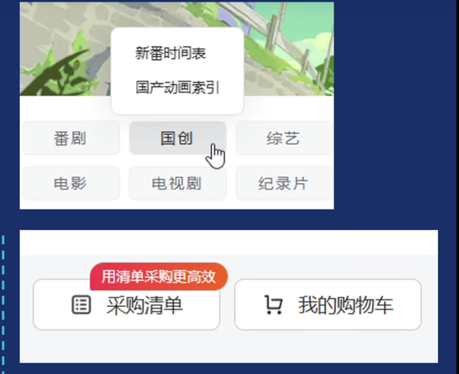


​	

**小技巧：**

1. 使用阴影： 阴影不占位置，所以不会增加盒子大小，从而不影响布局。

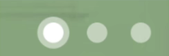

2. 定位的盒子垂直居中： 

   绝对定位： top: 50%; 

   往上走盒子自身高度的一半： margin-top: xxpx;


**特殊效果：**


1. 利用 before 和 after 覆盖； 
2. 背景色和网页的底色一致。


## 3.4 grid 布局


## 3.5 多列布局


# 4. 交互动效设计


# 5. 前沿技术拓展


# 6. 移动网页开发


# 7. 响应网页开发


# 8. 前端网页托管


​		
