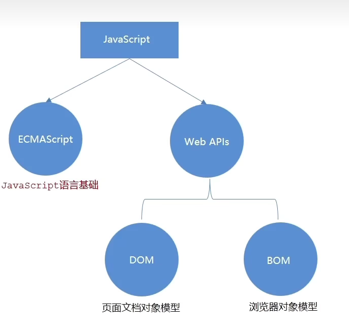
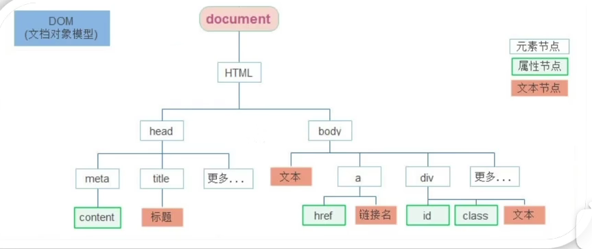
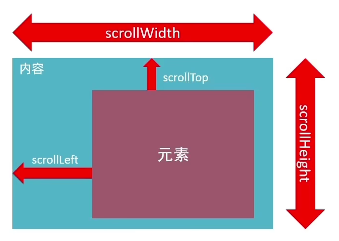
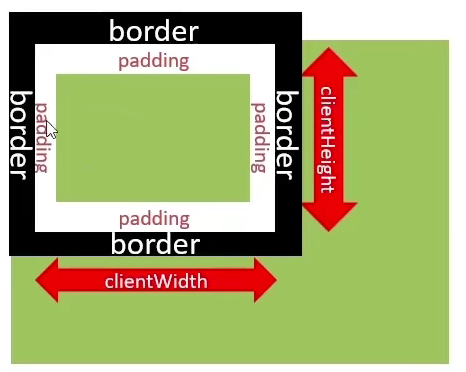
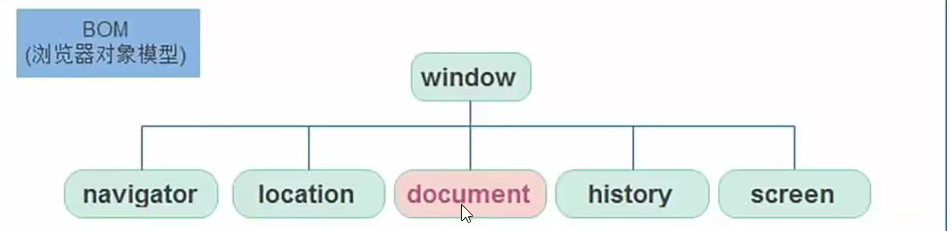
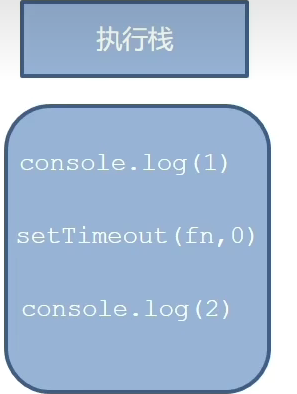
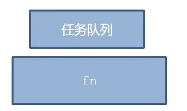
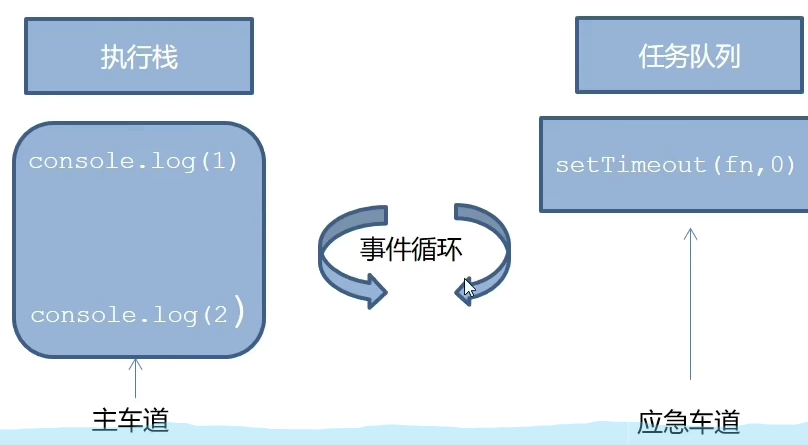
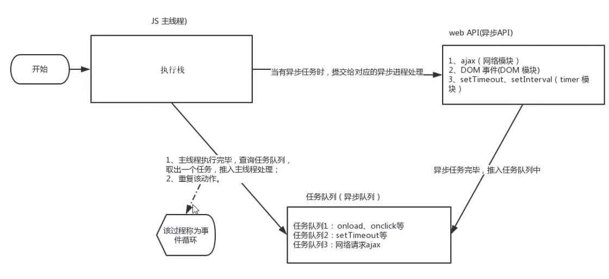
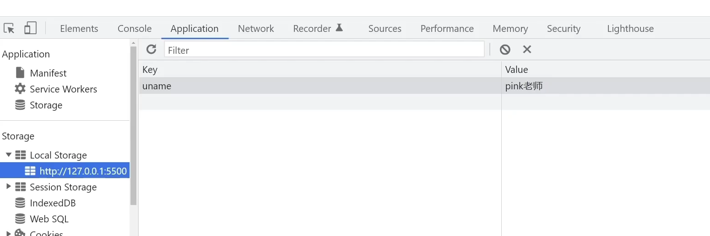

变量声明： 

建议： const 优先，尽量使用const。


# 1.获取元素

## 1.1 Web API 基本认知

### 1.1.1 作用和分类

作用： 使用 JS 去操作 html 和浏览器

分类： DOM（文档对象模型）、BOM（浏览器对象模型）




### 1.1.2 什么是 DOM

DOM（Document Object Model -- 文档对象模型）是用来呈现以及与任意 HTML 或 XML 文档交互的 API。 是浏览器提供的一套专门用来操作网页内容的功能。

DOM的作用：

- 开发网页内容特效和实现交互式。

### 1.1.3 DOM 树

DOM 树是什么

- 将 HTML 文档以树状结构直观的表现出来，我们称之为文档树或 DOM 树
- 描述网页内容关系的名词
- 作用：文档树直观的体现了标签与标签之间的关系。



### 1.1.4 DOM 对象

浏览器根据 html 标签生成的 JS 对象

- 所有的标签属性都可以在这个对象上面找到

- 修改这个对象的属性会自动映射到标签身上

  ```js 
  console.dir(div)   # 打印对象
  ```

DOM 的核心思想: 把网页内容当作对象来处理

document 对象: 

- 是 DOM 里提供的一个对象
- 所以它提供的属性和方法都是用来访问和操作网页内容的: `document.write()`
- 网页所有内容都在 document 里面


## 1.2 获取 DOM 元素

### 1.2.1 根据 CSS 选择器来获取

1. 选择匹配的第一个元素： 
   - 语法： `document.querySelector('css选择器')`
   - 参数： 包含一个或多个有效的 CSS选择器字符串
   - 返回值：CSS选择器匹配的第一个元素，一个 HTMLElement 对象。如果没有匹配到，则返回 null.
2. 选择匹配的多个元素： 
   - 语法：`document.querySelectorAll('css选择器')`
   - 返回值：CSS选择器匹配的 NodeList 对象集合


### 1.2.2 其它获取 DOM 元素方法

```js
// 根据 id 一个获取
document.getElementById('nav')
// 根据 标签获取一类元素 （获取页面所有 div）
document.getElementByTagName('div')
// 根据 类名获取元素 （获取页面所有类名为 'w'的）
document.getElementByClassName('W')
```


## 1.2 操作元素内容

实现修改元素的文本内容更换

1. `对象.innerText属性`

   ```js
   // 1. 获取元素
   const box = document.querySelector('.box')
   // 2. 修改文字内容 对象.innerText 属性
   console.log(box.innerText)  // 获取文字内容
   box.innerText = '修改'
   ```

   不会解析标签

2. `对象.innerHTML属性`

   - 将文本内容添加/更新到任意标签位置

   - 会解析标签，多标签建议使用模板字符

     ```js
     info.innerHTML = 'hello, <srong>Boy</strong>'
     ```

     

## 1.3 操作元素属性

### 1.3.1 操作元素常用属性

通过 js 设置/修改标签元素属性，比如通过 src 更换图片. 最常见的属性比如：href,  title, src 等。

语法：`对象.属性 = 值`


### 1.3.2 操作元素样式属性

通过 js 设置/修改 标签元素的样式属性

- 比如通过 轮播图小圆点自动更换颜色样式
- 点击按钮可以滚动图片，这是移动的图片的位置 left 等等。

途径：

- 通过 style 属性操作 CSS 
- 操作类名（ClassName）操作 CSS 
- 通过 classList 操作类控制 CSS 


1. 通过 style 属性操作 CSS 

   语法：`对象.style.样式属性 = 值`

   ```js
   // 1. 获取元素
   const box = document.querySelector('.box')
   // 2. 修改样式属性，对象 .style.样式属性 = '值'  别忘了跟单位
   box.style.width = '300px'
   // 多组单词采取 小驼峰命名法 background-color = 'red'
   box.style.backgroundColor = 'hotpink'
   ```


2. 操作类名（className）操作 CSS

   - 如果修改样式比较多，直接通过 style 属性修改比较繁琐，我们可以通过借助于 CSS 类名形式。

   - 语法：`元素.className = 'active'`

     >1. 由于 class 是关键字，所以使用 className 去代替
     >2. className 是使用新值换旧值，如果需要添加一个类，需要保留之间的类名


3. 通过 classList 操作控制 CSS

   - 为了解决 className 容易覆盖以前的类名，我们可以通过 classList 方式追加和删除类名

     ```js
     // 追加一个类
     元素.classList.add('类名')
     // 删除一个类
     元素.classList.romove('类名')
     // 切换一个类
     元素.classList.toggle('类名')
     ```


### 1.3.3 操作表单元素的属性

表单很多情况，也需要修改属性，比如点击眼睛可以看到密码，本质是把表单类型转换为文本框。正常的有属性有取值的，跟其它的标签属性没什么区别。

- 获取： `DOM对象.属性名`

- 设置：`DOM对象.属性名 = 新值`

  ```js
  表单.value = '用户名'
  表单.type = 'password'
  ```

- 表单属性中添加就有效果，移除就没有效果，一律使用布尔值表示，如果 true 代表添加了该属性，如果是 false 代表移除了该属性。比如：`disabled, checked, selected`


**自定义属性：**

- 标准属性：标签天生自带属性 比如class, id, tilte 等。可以直接使用点语法操作，如：disabled, checked, selected

- 自定义属性：

  - 在 html5 中推出来了专门的 data-自定义属性

  - 在标签一律以 data-开头

  - 在 DOM对象上一律以 dataset 对象方式获取

    ```html
    <body>
       <div class="box" data-id="10">盒子</div> 
       <script>
           const box = document.querySelector('.box')
           console.log(box.dataset.id)
        </script>
    </body>
    ```


### 1.3.4 定时器—间歇函数

网页中经常会需要一种功能：每隔一段时间需要自动执行一段代码，不需要手动触发。例如网页中的倒计时。

**间歇函数**

- 定时器函数介绍
- 定时器函数基本使用

1. 开启定时器

   `setInterval(函数,间隔时间)`

   - 作用：每隔一段时间调用这个函数
   - 每隔时间单位是毫秒

   ```js
   setInterval(function(){
   	console.log('一秒执行一次')
   }, 1000)
   ```

   > 1. 函数名字不需要加括号
   > 2. 定时器返回的是一个 id 数

2. 关闭定时器

   ```js
   let 变量名 = setInterval(函数, 间隔时间)
   clearInterval(变量名)	
   ```

​	一般不会刚创建就停止，而是满足一定条件在停止。

> button 按钮特殊，用innerHTML 获取 值


# 2. 事件

## 2.1 事件监听（绑定）

**什么是事件？**

​	事件是在编程时系统内发生的动作或者发生的事情。比如用户在网页上单机一个按钮。

**什么是事件监听？**

​	就是让程序检测是否有事件产生，一旦有事件触发，就立即调用一个函数做出响应，也称为 绑定事件或者注册事件。比如鼠标经过显示下拉菜单，比如点击可以播放轮播图等。


### 2.1.1 时间监听

语法： `元素对象.addEventLishtener('事件类型', 要执行的函数)`

事件监听三要素： 

- 事件源： 那个 dom 元素被事件触发了，要获取 dom 元素
- 事件类型：用什么方式触发，比如鼠标单击 click, 鼠标经过 mouseover 等。
- 事件调用的函数：要做什么事情

```html
<button>按钮</button>
<script>
	const btn = document.querySelector('.btn')
    // 修改元素样式
    btn.addEventListener('click', function()){
    	alert('点击了~')    
    }
</script>
```

>1. 事件类型要加引号
>
>2. 函数是点击之后再去执行，每次点击都会执行一次


### 2.1.2 事件监听版本

- DOM L0

  `事件源.on事件 = function(){}`

- DOM L2

  `事件源.addEventListener(事件, 事件处理函数)`

- 区别：

  on 方式会被覆盖，addEvenetListener 方式可绑定多次，拥有事件更多特性，推荐使用。


## 2.2 事件类型

### 2.2.1 鼠标事件

**鼠标触发**

- `click`：鼠标点击
- `mouseenter`：鼠标经过
- `moseleave`：鼠标离开

```js
const div = document.querySelector('div')
// 鼠标经过
div.addElevntListener('mouseenter', function(){
    console.log('经过')
})
```


### 2.2.2 焦点事件

**表单获得光标**

- `focus`：获得焦点
- `blur`：失去焦点


### 2.2.3 键盘事件

**键盘触发**

- `keydown`：键盘按下触发
- `keyup`：键盘抬起触发


### 2.2.4 文本事件

**表单输入触发**

- `input`：用户输入事件


## 2.3 事件对象

**事件对象是什么**

- 也是个对象，这个对象里有事件触发时的相关信息。例如，鼠标点击事件中，事件对象就像存了鼠标点在哪个位置等信息。

**使用场景：**

- 可以判断用户按下哪个键，比如回车键可以发布新闻。
- 可以判断鼠标点击了哪个元素，从而做相应的操作。

### 2.3.1 获取事件对象

语法： 如果获取

- 在事件绑定的回调函数的第一个参数就是事件对象。

- 一般命名为 event, ev, e

  ```js
  元素.addEventListener('click', function(e){})
  ```

  

### 2.3.2 事件对象常用属性

部分常用属性:

- `type`：获取当前事件的类型
- `client/clientY`：获取光标相对于浏览器可见窗口左上角的位置
- `offsetX/offsetY`：获取光标相当于当前 DOM 元素左上角的位置
- `key`：用户按下的键盘键的值。现在不提倡使用 keyCode

```js
const input = document.querySelector('input')
input.addEventListener('keyup', function(e){
    if(e.key === 'Enter'){
        console.log('回车')
    }
})
```


## 2.4 环境对象

**环境对象：**指的是函数内部特殊的变量 this， 它代表着当前函数运行时所处的环境。

**作用:**弄清除 this 的指向，可以让我们的代码更整洁。

- 函数的调用方式不同，this 指代的对象也不同。
- 谁调用，this 就是谁，是判断 this 指向的粗略规则。
- 直接调用函数，其实相当于是 window.函数，所以this 指代 window

```js
const btn = document.querySelector('button')
btn.addEventListener('click', function(){
    console.log(this)                 // 结果：  <button>点击<button>
})
```


## 2.5 回调函数

如果将函数 A 作为参数传递给函数 B 时，我们称函数 A 为回调函数。（当一个函数当作参数来传递给另外一个函数的时候，这个函数就是回调函数）

- 常见使用场景：

  ```js
  function fn(){
  	console.log('我是回调函数...')
  }
  // fn 传递给了 setInterval, fn就是回调函数
  setInterval(fn, 1000)
  ```

  


## 2.6 事件流

### 2.6.1 事件流与两个阶段

- 事件流指的是完整执行过程中的流动路径。
- 说明：假设页面里有个 div ，当触发事件时，会经历两个阶段，分别是捕获阶段、冒泡阶段。
- 简单来说：捕获阶段是 从父到子 冒泡阶段是从子到父
- 实际工作都是使用事件冒泡为主

### 2.6.2 事件捕获

事件捕获概念：从 DOM 的根元素开始去执行对应的事件（从外到里）。

事件捕获需要写对应代码才能看到效果。

代码：`DOM.addEventListener(事件类型, 事件处理函数, 是否使用捕获机制)`

>addEventListener 第三个参数传入 true 代表是捕获阶段触发
>
>若传入 false 代表冒泡阶段触发，默认就是 false
>
>若是 L0 事件监听，则只有冒泡阶段，没有捕获


### 2.6.3 事件冒泡

概念：当一个元素的事件被触发时，同样的事件将会在该元素的所有祖先元素中依次被触发。这一过程被称为事件冒泡。当一个元素触发事件后，会依次向上调用所有父级元素的同名事件。 

事件冒泡时默认存在的。 

L2 事件监听第三个参数是 false， 或者默认都是冒泡。


### 2.6.4 阻止冒泡

**阻止冒泡**

问题：因为默认就有冒泡模式的存在，所有容易导致事件影响到父级元素

需求：若想把事件就限制在当前元素内，就需要阻止事件冒泡。

前提：阻止事件冒泡需要拿到事件对象。

语法：`事件对象.stopPropagation()`

> 此方法可以阻断事件流动传播，不光在冒泡阶段有效，捕获阶段也有效。

```js
son.addEventListener('click', function(e){
	alert('son')
	e.stopPropagation()
})
```


**阻止元素默认行为**

我们某些情况下需要阻止默认行为的发生，比如 阻止链接的跳转，表单域跳转

语法：

```js 
const form = document.querySelector('form')
form.addEventListener('click', function(e){
    // 阻止表单默认提交行为
    e.preventDefault()
})
```


### 2.6.5 解绑事件

**on 事件方式**，直接使用 null 覆盖就可以实现事件的解绑。 

语法：

```js
// 绑定事件
btn.onclick = function(){
	alert('点击了')
}
// 解绑事件
btn.onclick = null
```


**addEventListener** 方式，必须使用：`removeEventListener`（事件类型，事件处理函数，[获取捕获或者冒泡阶段])

```js
function fn() {
	alert('点击')
}
// 绑定事件
btn.addEventListener('click', fn)
// 解绑事件
btn.removeEventListener('click', fn)
```

>匿名函数无法解绑															


**鼠标经过事件**

- moseover 和 mouseout 会有冒泡效果
- mouseenter 和 mouseleave 没有冒泡效果（推荐）


**两种注册事件的区别：**

1. 传统 on 注册（L0）
   - 同一个对象，后面注册的事件会覆盖前面注册（同一个事件）
   - 直接使用 null 覆盖就可以实现事件的解绑
   - 都是冒泡阶段执行的
2. 事件监听注册（L2）
   - 语法：addEventListener（事件类型，事件处理函数，是否使用捕获）
   - 后面注册的事件不会覆盖前面注册的事件（同一个事件）
   - 可以通过第三个参数去确定是在冒泡或捕获阶段执行
   - 必须使用 removeEventListener(事件类型，事件处理函数，获取捕获或者冒泡阶段)
   - 匿名函数无法被解绑


## 2.7 事件委托

事件委托是利用事件流的特征解决一些开发需求的知识技巧。

- 优点：减少注册次数，可以提高程序性能。
- 原理：时间委托其实是利用事件冒泡的特点。
  - 给父元素注册事件，当我们触发子元素的时候，会冒泡到父元素身上，从而触发父元素的事件。

>如何找到真正触发的元素：
>
>事件对象.target.tagName


## 2.8 其它事件

### 2.8.1 页面加载事件

加载外部资源（如图片、外联CSS 和 JavaScrip等）加载完毕时触发的事件

为什么要学：

- 有些时候需要等待页面资源全部处理完了做一些事情
- 老代码喜欢把 script 写在 head 中，这时候直接找 dom 元素找不到。

事件名：`load`

监听页面所有资源加载完毕：

- 给 window 添加 load 事件

  ```js
  // 页面加载事件
  window.addEventListener('load', function(){
  	// 执行操作
  }
  ```

  注意：不光可以监听整个页面资源加载完毕，也可以针对某个资源绑定 load 事件


当初始的 HTML 文档被完全加载和解析完成之后，DOMContentLoaded 事件被触发，而无需等待样式表、图像等完全加载。 

事件：`DOMContentLoaded`

监听页面 DOM 加载完毕：

​	给 document 添加 DOMContentLoad 事件

```js
document.addEventListener('DOMContentLoaded', function(){
	// 执行操作
})
```


### 2.8.2 元素滚动事件

滚动条在滚动的时候持续触发的事件。很多页面需要检测用户把页面滚动到某个区域后做一些处理，比如固定导航栏，比如返回顶部。

事件名：`scroll`

监听整个页面滚动:

```js
// 页面滚动事件
window.addEventListener('scroll', function(){
	// 执行的操作
})
```

给 window 或 document 添加 scroll 事件 都可以实现。 

监听某个元素的内部滚动直接给某个元素添加即可。 


**获取位置**

scrollLeft 和 scrollTop （属性）

- 获取被卷去的大小
- 获取元素内容往左、网上滚出去看不到的距离
- 这两个值是可读写的




```js
const div = document.querySelector('div')
div.addEventListener('scroll', function(){
    console.log(div.scrollTop)
})
```

>获取 html 元素写法：`document.documentElement`

```js
elevalor.style.opacity = n >= 300 ? 1 : 0
```


### 2.8.3 页面尺寸事件

1. 会在窗口尺寸改变的时候触发事件

   - `resize`：`window.addEventListener('resize', function(){ })`

2. 检测屏幕宽度：

   ```js
   window.addEventListener('resize', function(){
       let w = document.documentElement.clientWidth
       console.log(w)
   })
   ```

3. 获取元素宽高

   - 获取宽高

     - 获取元素的可见部分宽高（不包含边框，margin，滚动条等）
     - clientWidth 和 clientHeight

     

## 2.9 元素尺寸与位置

前面案例滚动多少距离，都是我们自己算的，最好是滚动到某个元素，就可以做某些事。简单地说就是通过 js 方式，得到元素在页面中的位置。

- 尺寸
  - 获取宽高：
    - 获取元素的自身宽高、包含元素自身设置的宽高、padding、border
    - offsetWidth 和 offsetHeight 
    - 获取出来的是数值，方便计算
    - 注意：获取的是可视宽高，如果盒子是隐藏的，获取的结果是0
  - 获取位置
    - 获取元素记录自己定位父级元素的左、上距离
    - offsetLeft 和 offsetTop 注意是只读属性


# 3. 日期对象


## 3.1 实例化

在代码中发现了 new 关键字时，一般将这个操作称为实例化。创建一个时间对象并获取时间：

- 获得当前时间：`const date = new Date()`
- 获得指定时间：`const date = new Date('2008-8-8')`


## 3.2 日期对象方法

因为日期对象返回的数据我们不能直接使用，所以需要转换为实际开发中常用的格式。

| 方法          | 作用               | 说明                 |
| ------------- | ------------------ | -------------------- |
| getFullYear() | 获得年份           | 获取四位年份         |
| getMonth()    | 获得月份           | 取值为 0~11          |
| getDate()     | 获取月份中的每一天 | 不同月份取值也不相同 |
| getDay()      | 获取星期           | 取值为 0~6           |
| getHours()    | 获取小时           | 取值为 0~23          |
| getMinutes()  | 获取分钟           | 取值为 0~59          |
| getSeconds()  | 获取秒             | 取值为 0~59          |

```js
date.toLocaleString()   // 2022/4/1 09：41：21
```


## 3.3 时间戳

如果计算倒计时效果，前面方法无法直接计算，需要借助于时间戳完成。

什么是时间戳：是指 1970年01月01日00时00分00秒 起至现在的毫秒数，它是一种特殊的计量时间的方式。 

算法：

- 将来的时间戳 - 现在的时间戳 = 剩余时间毫秒数
- 剩余时间毫秒数 转换为 剩余时间的 年 月 日 时 分 秒 就是 倒计时时间
- 比如   将来时间戳（2000ms） - 现在时间戳（1000ms） = 1000ms
- 1000 ms 转换为 就是 0小时0分1秒


### 3.3.1 三种方式获取时间戳

1. 使用 `getTime()` 方法

   ```js
   const date = new Date()
   console.log(date.getTime())
   ```

2. 简写 `+new Date()`

   ```js
   console.log(+new Date())
   
   console.log(+new Date('2022-4-1 18:30:00'))
   ```

3. 使用 `Date.now()

   ```js
   console.log(Date.now())
   ```

   无需实例化，但是只能得到当前的时间戳，而前面两种可以返回指定时间的时间戳。


# 4. 节点操作

## 4.1 DOM 节点

- DOM 节点：DOM 树里每一个内容都称之为节点
- 节点类型：
  - 元素节点：
    - 所有的标签，比如 body，div
    - html 是 根节点
  - 属性节点：所有的属性，比如 href 
  - 文本节点：所有的文本
  - 其它


## 4.2 查找节点

节点关系： 针对的找亲戚返回的都是对象

- 父节点
  - parentNode 属性：`子元素.parentNode`
  - 返回最近一级的父节点 找不到返回为 null 

- 子节点

  - childNodes 

    获得所有子节点、包括文本节点（空格、换行）、注释节点等

  - children 属性（重点）：`父元素.children`

    仅获得所有元素节点

    返回的还是一个伪数组

- 兄弟节点
  1. 下一个兄弟节点： 
     - nextElementSibling 属性
  2. 上一个兄弟节点
     - previousElementSibling 属性	


## 4.3 增加节点

很多情况下，我们需要在页面中增加元素，比如，点击发布按钮，可以新增一条信息。

一般情况下，我们新增节点，按照如下操作：

- 创建一个新的节点
- 把创建的新的节点放入到指定的元素内部


1. 创建节点

   即创造出一个新的网页元素，再添加到网页内，一般先创建节点，然后再插入节点。

   创建元素节点方法：`document.createElement('标签名')`

2. 追加节点

   想要再界面看到，还得插入到某个父元素中

   - 插入到父元素的最后一个子元素：`父元素.appendChild(要插入的元素)`
   - 插入到父元素中某个子元素的前面：`父元素.insertBefore(要插入的元素，在那个元素前面)`

3. 克隆节点

   特殊情况下，我们新增节点，需要复制一个原有节点，把复制的节点放入到指定的元素内部。 

   克隆节点：`元素.cloneNode(布尔值)`

   - cloneNode 会克隆出一个跟原标签一样的元素，括号内传入布尔值。 
   - 若为 true，则代表克隆时会包含后代节点一起克隆。
   - 若为 false，则代表科隆时不会包含后代节点
   - 默认为 false

## 4.4 删除节点

若一个节点在页面中已不需要时，可以删除它，在 js 原生 DOM 操作中，要删除元素必须通过父元素删除。 

语法：`父元素.removeChild(要删除的元素)`

- 如果不存在父子关系则删除不成功
- 删除节点和隐藏节点（display: none）有区别的：隐藏节点还是存在的，单数删除，从 html 中删除节点


# 5. M 端事件

移动端也有自己独特的地方，比如**触屏事件 touch**(也称触摸事件)，Android 和 IOS 都有。 

- **屏事件 touch**(也称触摸事件)，Android 和 IOS 都有。 

- touch 对象代表一个触摸点。触摸点可能是一根手指，也可能是一根触摸笔。触屏事件可响应用户手指（或触控笔）对屏幕或者触控板操作。

  | 触屏 touch 事件 | 说明                           |
  | --------------- | ------------------------------ |
  | touchstart      | 手触摸到一个DOM元素时触发      |
  | touchmove       | 手指在一个DOM元素上滑动时触发  |
  | touchend        | 手指从一个DOM 元素上移开时触发 |

  


# 6. JS 插件

插件就是别人写好的一些代码，我们只需要复制对应的代码，就可以直接实现对应的效果。

基本过程：

- 熟悉官网，了解这个插件可以完成什么需求：https://www.swiper.com.cn/
- 观看在线演示，找到符合自己需求的 demo：https://www.swiper.com.cn/demo/index.html
- 查看基本使用流程：https://www.swiper.com.cn/usage/index.html
- 查看 APi文档，去配置自己的插件：https://www.swiper.com.cn/api/index.html
- 注意：多个swiper 同时使用的时候，类名需要注意区分 


# 7. Window对象

## 7.1 BOM（浏览器对象模型）

BOM（Browser Object Model）是浏览器对象模型  

- window 对象是一个全局对象，也可以说是 js 中的顶级对象
- 像 document, alert() , console.log() 这些都是 window 的属性，基本 BOM 的属性和方法都是 window 的。
- 所有通过 var 定义在全局作用域中的变量，函数都会编程 window 对象的属性和方法
- window 对象下的属性和方法调用的时候可以省略 window


## 7.2 定时器-延时函数

JS  内置的一个用来让代码延迟执行的函数，叫 setTimeout

语法：`setTimeout(回调函数, 等待的毫秒数)`

setTimeout 仅仅只执行依次，所以可以理解为就是把一段代码延迟执行，平时省略 window


清除延时函数：

```js
let timer = setTimeout(回调函数，等待的毫秒数)
clearTimeout(timer)
```

>延时器需要等待，所以后面的代码先执行
>
>每一次调用延时器都会产生一个新的延时器


## 7.3 JS 执行机制

JS 语言的一大特点就是单程线，也就是说，同一个时间只能做一件事。这是因为 JS 这门脚本语言诞生的使命所致——JS只为了处理页面中用户的交互，以及操作DOM 而诞生，比如我们对某个 DOM 元素进行添加和删除操作，不能同时进行，应该先进行添加，之后再删除。

单线程就意味着，所有任务需要排队，前一个任务结束，才会执行后一个任务，这样所导致的问题是：如果 JS 执行的时间过长，这样就会造成页面的渲染不连贯，导致页面渲染加载阻塞的感觉。


为了解决这个问题，利用多核 CPU 的计算能力，HTML5 提出的 Web Worker 标准，允许 JavaScript 脚本创建多个线程。于是，JS 中出现了同步和异步。 

- **同步**

  前一个任务结束后再执行后一个任务，程序的执行顺序与任务的排列顺序是一致的、同步的。

- **异步**

  你在做一件事情的时候，因为这件事情会花费很长时间，在做这件事的同时，你还可以去处理其它事情。

- 本质区别：这条流水线上各个流程的执行顺序不同。

```js
console.log(1)
setTimeout(function(){
	console.log(2)
}, 1000)
console.log(3)
// 输出结果： 132

console.log(1)
setTimeout(function(){
	console.log(2)
}, 0)
console.log(3)
// 输出结果： 132
```

**同步任务：**
	同步任务都在主线上执行，形成一个执行栈。

**异步执行：**

​	JS 的异步是通过回调函数实现的。一般而言，异步任务有以下三种类型：

1. 普通事件，如 click、resize 等。
2. 资源加载，如 load、error 等。 
3. 定时器，包括 setInterval、setTimeout 等。

​	异步任务相关添加到任务队列中（任务队列也成称为消息队列）。

**执行机制**

1. 先执行执行栈中的同步任务。 

2. 异步任务放入到任务队列中。

3. 一旦执行栈中的所有同步任务执行完毕，系统就会按次序读取任务队列中的异步任务，于是被读取的异步任务结束等待状态，进入执行栈，开始执行。

   




由于主线程不断的重复获得任务、执行任务、再获取任务、再执行，所以这种机制被称为 事件循环（event loop）。 


## 7.4 location 对象

location 的数据类型是对象，它拆分并保存了 URL 地址的各个组成部分。

**常用属性和方法：**

- href 属性获取完整的 URL地址，对其赋值时用于地址的跳转。	

  ```js
  // 可以得到当前文件的 URL地址
  console.log(location.href)
  // 可以通过 js 方式跳转到目标地址
  location.href = "https://www.baidu.com"
  ```

- search 属性获取地址中携带的参数，符号 ? 后面的部分

  ```js
  console.log(location.search)
  ```

- hash 属性获取地址中的哈希值，符号 # 后面部分

  ```js
  <a href="#my">我的</a>
  console.log(location.hash)
  ```

  后期 vue 路由的铺垫，经常用于刷新页面，显示不同页面。

- reload 方法用来刷新当前页面，传入参数 true 时表示强制刷新

  ```js
  <button class="reload">刷新</button>
  <script>
      const reload = document.querySelector('.reload')
  	reload.addEventListener('click', function(){
          location.reload()  // f5 刷新页面
          location.reload(true)  // 强制刷新 ctrl+f5
      })
  </script>
  ```


## 7.5 navigator 对象

navigator 的数据类型是对象，该对象记录了浏览器自身的相关信息。 

**常用属性和方法：**

- 通过 userAgent 检测浏览器的版本及平台

  ```js
  // 检测 userAgent(浏览器信息)
  !(function(){
      const userAgent = navigator.userAgent
      // 验证是否为 Android 或 iphone 
      const android = userAgent.match(/(Android);[￥s￥/]+([￥d.]+)?/)
      const iphone = userAgent.match(/(iPhone￥sOS)￥s([￥d_]+)/)
      
      // 如果是 Android 或 iPhone，则跳转至移动站点
      if(android||iphone){
          location.href = 'http://m.itcast.cn'
      }
  })()
  
  // 匿名函数
  !(function(){ })();
  !function(){}()
  ```


## 7.6 histroy 对象

history 的数据类型是对象，主要管理历史记录，该对象与浏览器地址栏的操作相对应，如前进、后退、历史记录等。

**常用属性和方法：**

- `back()`：可以后退功能。 
- `forward()`：前进功能
- `go(参数)`：前进后退功能，参数如果是 1 前进 1 个页面， 如果是 -1，后退1个页面

history 对象一般在实际开发中比较少用，但是会在一些 OA 办公系统中见到。


# 8 本地存储

## 8.1 本地存储介绍

以前我们页面的数据一刷新页面就没有了。随着互联网的快速发展，基于网页的应用越来越普遍，同时也会变的越来越复杂，为了满足各种各样的需求，会经常性在本地存储大量的数据，HTML5规范提出了相关的解决方案。

1. 数据存储在用户浏览器中
2. 设置、读取方便、甚至页面刷新不丢失数据
3. 容量较大，sessionStorage 和 localStorage 约 5M 左右
4. 常见使用场景：https://todomvc.com  页面刷新数据不丢失


## 8.2 本地存储分类

**localStorage**

作用：可以将数据永久存储在本地（用户的电脑），除非手动删除，否则关闭页面也会存在。 

特性：

- 可以多窗口（页面）共享（同一浏览器可以共享）
- 以键值对的形式存储使用

```js
// 存储一个名字 uname, pink
localStorage.setItem('uname', 'pink')
// 获取
console.log(localStorage.getItem('uname'))
// 删除本地存储
localStorage.removeItem('uname')
// 改
localStorage.setItem('uname', 'red')	
```



**sessionStorage**
特性：

- 生命周期为关闭浏览器窗口
- 在同一个窗口（页面）下数据可以共享
- 以键值对的形式存储使用
- 用法跟 localStorage基本相同


## 8.3 存储复杂数据类型

本地只能存储字符串，无法存储负载数据类型。 

解决：需要将复杂数据类型转换成 JSON 字符串，再存储到本地。

语法：`JSON.stringify(复杂数类型)`

```js
const goods = {
	name:'小米',
	price: 1000
}
// 复杂数据类型存储必须转换为 JSON 字符串存储
localStorage.setItem('goods',JSON.stringify(goods))
// 把 JSON 字符串转换为 对象
const str = localStorge.getItem('obj') 
console.log(JSON.parse(str))
```


## 8.4 数组map和jion方法

字符串拼接新思路：利用 map() 和 join() 数组方法实现字符串拼接（效率更高，开发常用的写法）


**数组中 map方法**：迭代数组

map 可以遍历数组处理数据，并返回新的数组

```js
const arr = ['red', 'blue', 'green']
const newArr = arr.map(function(ele, index){
	console.log(ele)   // 数组元素
    console.log(index)  // 数组索引号
    return ele + '颜色'
})
console.log(newArr)  // ['red颜色', 'blue颜色', 'green颜色']
```

map 也成为映射。映射是指两个元素的集之间元素相互 "对应" 的关系。 map 重点在于有返回值，forEach 没有返回值。

 


**数组中join方法**
作用：join() 方法用于把数组中的所有元素转换为一个字符串

语法：

```js
const arr = ['red颜色', 'blue颜色', 'green颜色']
console.log(arr.join(''))  // red颜色blue颜色green颜色
```

参数：数组元素是通过参数里面指定的分隔符进行分隔的，空字符串（'')，则所有元素之间都没有任何字符。


# 9.正则表达式

## 9.1 介绍

正则表达式（Regular Expression）是用于匹配字符串中字符组合的模式。在 JavaScript 中，正则表达式也是对象。 通常用来查找、替换那些符合正则表达式的文本，许多语言都支持正则表达式。 	

**什么是正则表达式**：

正则表达式在 JavaScript 中的使用场景：

- 例如验证表单：用户名表单只能输入英文字母、数字或者下划线，昵称输入框中可以输入中文（匹配）。 比如用户名：`/^[a-z0-9_-]{3,16}$/`
- 过滤掉页面内容中的一些敏感词（替换），或从字符串中获取我们想要的特定部分（提取）等。


## 9.2 语法

JavaScript 中定义正则表达式的语法有两种

1. 定义正则表达式语法：

   `const 变量名 = /表达式/`，其中 / / 是正则表达式字面量。 

2. 判断是否有符合规则的字符串：

   test() 方法，用来查看正则表达式与指定的字符串是否匹配： 

   `regObf.test(被检测的字符串)`

```js
// 要检测的字符串
const str = 'IT培训，前端开发培训，IT培训课程，web前端培训，Java培训，人工智能培训'
// 1. 定义正则表达式，检测规则
const reg = /前端/
// 2. 检测方法
console.log(reg.test(str))  // true
```

如果正则表达式与指定的字符串匹配，返回 true，否则 false


3. 检索（查找）符合规则的字符串：

   exec() 方法， 在一个指定字符串中执行一个搜索匹配。 

   语法：`regObj.exec(被检测的字符串)`

```js
// 要检测的字符串
const str = 'IT培训，前端开发培训，IT培训课程，web前端培训，Java培训，人工智能培训'
// 1. 定义正则表达式，检测规则
const reg = /前端/
// 2. 检测方法
console.log(reg.exec(str))  // 返回的是数组
// ['前端', index:5, input:'IT培训，前端开发培训，IT培训课程，web前端培训，Java培训，人工智能培训', groups:undefined]
```

如果匹配成功，exec() 方法返回一个数组，否则返回null 


## 9.3 元字符

**普通字符：**

大多数的字符仅能够描述它们本身，这些字符称作普通字符，例如所有的字母和数字。也就是普通字符只能够匹配字符串中与他们相同的字符。

**元字符：**

是一些具有特殊含义的字符，可以极大提高了灵活性和强大的匹配功能。 比如，规定用户只能输入26个英文字母，普通字符的话，adcdefghijklm......但是换成元字符写法：[a-z]

**参考文档：**

MDN：https://developer.mozilla.org/zh-CN/docs/Web/JavaScript/Guide/Regular_Expressions

正则测试工具：http://tool.oschina.net/regex


为了方便记忆和学习，我们对众多的元字符进行了分类：

- 边界符（表示位置，开头和结尾，必须用什么开头，用什么结尾）

  正则表达式中的边界符（位置符）用来提示字符所处的位置，主要有两个字符。

  | 边界符 | 说明                           |
  | ------ | ------------------------------ |
  | ^      | 表示匹配首行的文本（以谁开始） |
  | $      | 表示匹配行尾的文本（以谁结束） |

  如果 ^ 和 $ 在一起，表示必须是精确匹配。

  ```js 
  console.log(/^哈$/.test('哈'))
  ```

- 量词（表示重复次数）

  量词用来设定某个模式出现的次数 

  | 量词   | 说明                       |
  | ------ | -------------------------- |
  | *      | 重复零次或更多次  >=0      |
  | +      | 重复一次或更多次  >=1      |
  | ?      | 重复零次 或 一次  0 \|\| 1 |
  | {n}    | 重复 n 次                  |
  | {n,}   | 重复 n 次 或 更多次        |
  | {n, m} | 重复n 到 m 次              |

  ```js 
  console.log(/^哈*$/.test('哈哈哈'))
  ```

- 字符类（比如 \d 表示 0~9）

  (1) [ ] 匹配字符集合

  后面的字符串只要包含 abc 中任意一个字符，都返回 true 

  ```js
  console.log(/^[abc]$/.test('andy'))  // true 
  console.log(/^[abc]$/.test('ab'))   // false
  console.log(/^[abc]{2}$/.test('ab'))   // true
  ```

  [ ] 里面加上 - 字符： 

  使用连字符 - 表示一个范围

  ```js
  console.log(/^[a-z]$/.test('c'))  // true
  ```

  比如：

  - [a-z] 表示 a 到 z 26个英文字母都可以
  - [a-zA-Z] 表示大小写都可以
  - [0-9] 表示 0~9 的数字都可以

  ```js
  qq号：^[1-9][0-9]{4,}$ 
  ```

  [ ] 里面加上 ^ 取反符号

  比如：

  - [^a-z] 匹配处理小写字母以外的字符。 注意要写到中括号里面。


​		（2） . 匹配除换行符紫外的任何单个字符。 


​		（3）预定义：指的是 某些常见模式的简写方式

| 预定义类 | 说明                                                         |
| -------- | ------------------------------------------------------------ |
| \d       | 匹配 0-9 之间的任一数字，相当于 [0-9]                        |
| \D       | 匹配所有 0-9 以外的字符，相当于 [\^0-9]                      |
| \w       | 匹配任意的字母、数字和下划线，相当于[A-Za-z0-9]              |
| \W       | 除所有字母、数字和下划线以外的字符，相当于[\^A-Za-z0-9]      |
| \s       | 匹配空格（包括换行符、制表符、空格符等），相当于[\t\r\n\v\f] |
| \S       | 匹配非空格的字符，相当于[\^\t\r\n\v\f]                       |

```js
日期格式：^\d{4}-\d{1,2}-\d{1,2}
```


## 9.4 修饰符

修饰符约束正则执行的某些细节行为，如是否区分大小写，是否支持多行匹配等。 

语法：`/表达式/修饰符`

- i 是 ignore 的缩写，正则匹配时字母不区分大小写

- g 是单词 global 的缩写，匹配所有满足正则表达式的结果。 

  ```js
  console.log(/a/i.test('a'))  // true 
  console.log(a/i.test('A'))  // true
  ```

- 替换 replace 

  ```js
  字符串.replace(/正则表达式/, '替换的文本')
  ```

  


