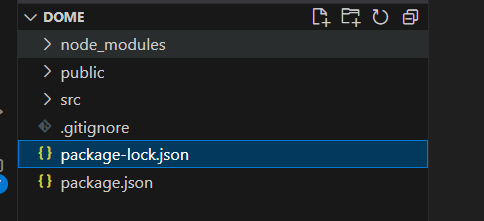
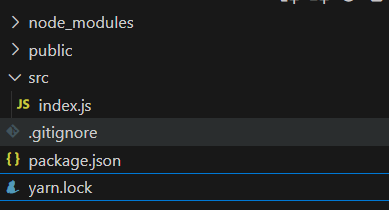
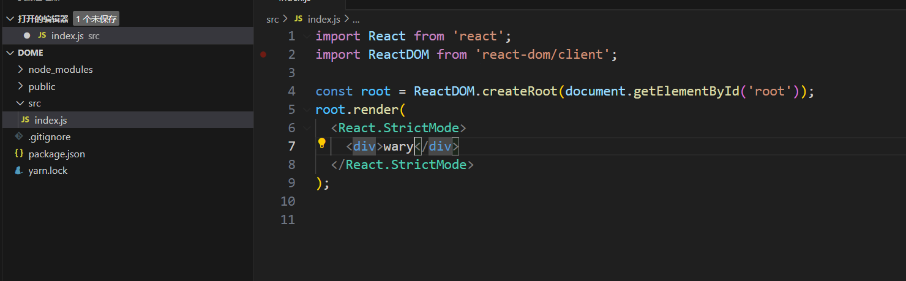
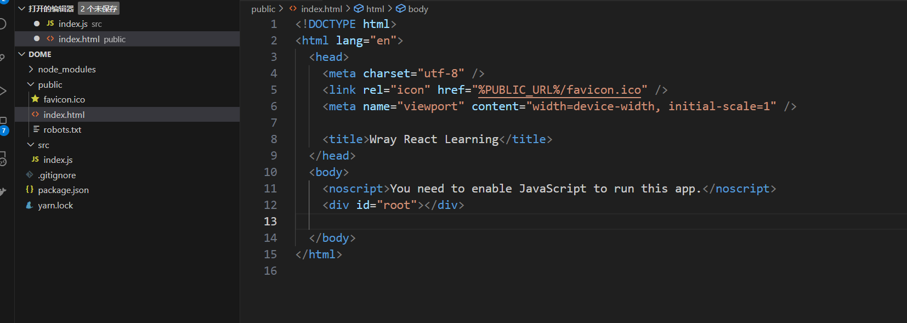

# 1. 使用 create-react-app 构建React工程化项目

当前未来的前端开发，一定是：组件化/模块化开发

1. 有利于团队协作开发；

2. 便于组件的复用：提高开发效率、方便后期维护，减少页面中的冗余代码

   ....

如何划分组件：

​	业务组件：针对项目需求封装

1. 普通业务组件：没啥复用性，只是单独拆出来的一个模块
2. 通用业务组件：具备复用性

​	功能组件：适用于多个项目，例如 UI 组件库中的组件

1. 通用功能组件


因为组件化开发，必然会带来“工程化”处理。也就是基于webpack等工具 vite/ rollup / turbopack... 

实现组件的合并、压缩、打包等

代码编译，兼容，校验等。 


React 的工程化/组件化开发

我们可以基于 webpack 自己搭建一套工程化打包的架子，但是这样非常麻烦/复杂；React 官方，为我们提供了一个脚手架;

create-react-app!!!

+ 脚手架：基于它创建项目，默认就把webpack的打包规则已经处理好了，把一些项目需要的基本文件也都创建好了。 
+ 

## 1.1 create-react-app 的基础运用

安装脚手架（自己选择使用 npm 还是用 yarn 安装） 

```shell
$ npm i create-react-app -g # mac前面要设置 sudo 
$ create-react-app --version  # 检查安装
```

基于脚手架创建 React 工程化的项目

```shell
$ create-react-app 项目名称
# 项目名称要遵循 npm 包命名规范：使用数字，小写字母，_ 命名
```

​	将项目放入到vscode 中打开，查看文件。

​	使用 yarn 安装：删除 package-lock.json 和 node_modules 文件

​	使用终端输入： yarn （vscode 终端： ctrl + `）



> 报错：
>
> error Error: certificate has expired at TLSSocket.onConnectSecure (node:_tls_wrap:1532:34) at TLSSocket.emit (node:events:527:28) at TLSSocket._finishInit (node:_tls_wrap:946:8) at TLSWrap.ssl.onhandshakedone (node:_tls_wrap:727:12)
>
> 解决方案：可以尝试禁用SSL证书验证。
>
> yarn config set strict-ssl false

​	


项目目录：

​	node-modules 

​	src：所以后续编写代码，几乎都放在 SRC 下，打包的时候，一般只对这个目录下的代码进行处理

​		index.js 

​	public：放页面模板

​		index.html  

​	package.json

​	... 


一个React 项目中，默认会安装：

​	react: React 框架的核心

​	react-dom：React 视图渲染的核心，基于 React构建 WebAPP（HTML 页面）

​	react-native：构建和渲染 App 的

​	react-scripts：脚手架让目录看起来干净一些，把 webpack 打包的规则及相关的插件 / LOADER等都隐藏到了 node_modules目录下，react-scripts 就是脚手架中自己对打包命令中的一中封装，基于它打包，会调用 node_modules中的webpack等进行处理。

​	web-vitals：性能检测工具


打包命名基于 react-scripts 处理。 

 	start: 开发环境，在本地启动 web 服务器，预览打包内容。 

​	build：生产环境，打包部署，打包的内容输出到 dist 目录中

​	test：单元测试

​	eject：暴露 webpack 配置规则，因为想要修改默认的打包规则。


eslintConfig：对 webpack中 ESLint 词法检测的相关配置；

​	词法检测：

​		词法错误：不符合规范

​		符合标准，代码本身不归报错，但是不符合 ESLint 的检测规范


browserslist: 基于 browserslist 规范，设置浏览器的兼容情况。

​	postcss-loader + autoprefixer 会给 CSS3 设置相关的前缀

​	babbel-loader 会把 ES6 编译为 ES5 


src 中只留下 index.js 入口






后期 webpack 打包的时候，会对这个语法进行编译，代表： public 这个根目录




## 1.2 修改默认的 webpack 配置项

## 1.3 webpack 打包优化


# 2.  React 基础知识

## 2.1 MVC & MVVM 的区别

## 2.2 JSX 语法构建视图及底层渲染机制

## 2.3 React 中的 DOM-DIFF 算法

## 2.4 合成事件以及底层原理


# 3. React 中的组件开发

## 3.1 纯函数组件

### 3.1.1 属性规则校验

### 3.1.2 仿 vue 中 slot 插槽的处理


## 3.2 类组件

### 3.2.1 Component 和 PureComponent 

### 3.2.2 state 装填及更新

### 3.2.3 setState 的批处理机制

### 3.2.4 生命周期函数

### 3.2.5 ref


## 3.3 React Hooks组件及实现原理

### 3.3.1 useState

### 3.3.2 useEffect 

### 3.3.3 useContext 

### 3.3.4 useReducer 

### 3.3.5 useCallback 

### 3.3.6 useRef 

### 3.3.7 uselmperativeHandle 

### 3.3.8 useLayoutEffect 

### 3.3.9 自定义Hook


## 3.4 组件通信的常规方案

### 3.4.1 父子通信

### 3.4.2 祖先和后代通信

### 3.4.3 平行组件通信


## 3.5 高阶组件及运用

## 3.6 Suspense 异步组件


# 4. React 样式的处理方案

## 4.1 内联样式

## 4.2 使用 CSS 样式表

## 4.3 React-JSS


# 5. 基于 redux 和 react-redux  构建“公共状态管理”机制

## 5.1 redux 基础和工程化

## 5.2 react-redux的应用

## 5.3 redux 中间件

## 5.4 深入redux 和 react-redux 核心

## 5.5 mobx


# 6. 基于 react-router-dom 构建前端路由机制

## 6.1 SPA & MPA

## 6.2 Hash 路由 和 History 路由的底层机制

## 6.3 router V5 的基础运用

## 6.4 router V6 的基础运用

## 6.5 路由跳转及传参


# 7. Antd 和 AntMobile 组件库

## 7.1 基础运用

## 7.2 核心组件：表单、table、文件上传等


# 8. 基础实战之知乎日报 WebApp 


